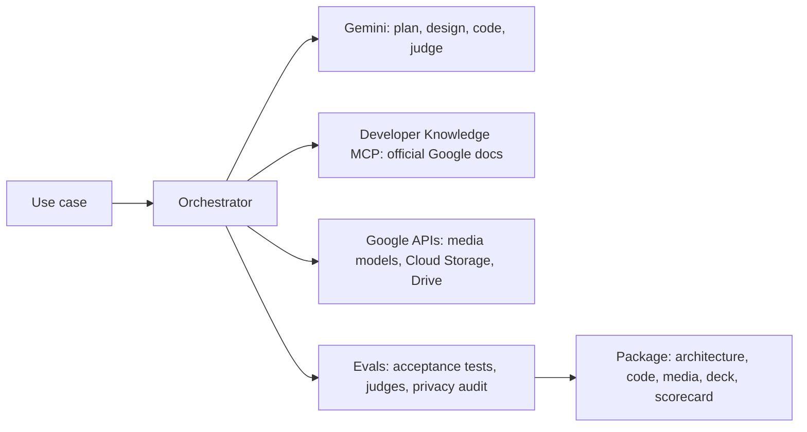

# Gemini + MCP Use-Case Studio

Turn a customer use case into a Google Cloud demo in about 10 minutes: a grounded architecture, starter code,
generated media, an editable deck and an eval scorecard.

**Author:** Layolin Jesudhass

## What you get

Type a use case, for example *"multilingual voice concierge for airline members"* or *"claims intake from
scanned forms"*. The studio returns:

- **Architecture**: each step mapped to a Google Cloud service and model, with the official doc behind every choice
- **Starter code**: a Python pipeline with its requirements and a README, packaged as a zip
- **Demo outputs**: videos, images, voice and music from Google's media models, or structured results and agent
  traces for non-media use cases
- **Story**: a hero, a challenge and a payoff, plus a presenter script
- **Deck**: PowerPoint, or Google Slides when run locally with Drive
- **Scorecard**: acceptance tests, judge scores and a privacy audit of the package
- **Chat**: ask questions or request changes ("add Korean", "shorten the video"), answered with doc citations

Example presets cover enterprise search with citations, document processing, an analytics agent, a voice
concierge and generative media.

## How it works



- **No hard-coded models**: the studio finds the newest models in Google's docs, verifies them in your project,
  tests them on a golden set and rolls back automatically if quality drops.
- **Grounded**: every service, model and package comes with an official Google doc link.
- **Checked**: every build is scored, and failing steps are retried.

## Quick start: Cloud Run

```bash
git clone https://github.com/LUJ20/gemini-mcp-studio.git && cd gemini-mcp-studio
./deploy.sh --project YOUR_PROJECT_ID
```

The script enables the APIs, creates a Cloud Storage bucket and a service account with only the roles the app
needs, builds the container, deploys it to Cloud Run behind Identity-Aware Proxy (IAP) and prints the URL.
Only you can open it at first. To let others in:

```bash
./deploy.sh --project YOUR_PROJECT_ID --allow user:NAME@example.com,group:TEAM@example.com
```

The first deploy takes about 5 minutes. Each new instance then spends a few minutes picking the newest models;
open the app sooner and the first page waits for that, once.

**Run locally instead:** `./deploy.sh --local --project YOUR_PROJECT_ID` opens http://localhost:8502. Local runs
can also publish decks to Google Slides with `--drive-folder <Drive folder URL or ID>`.

**Prerequisites**

- The [gcloud CLI](https://cloud.google.com/sdk/docs/install), signed in with `gcloud auth login`
- A Google Cloud project with billing, where you are an Owner
- Access to the models you want to show: preview models such as Veo appear only if your project can call them
- Python 3.10 or later (local runs only)

## Options

| Flag | Default | Purpose |
| :--- | :--- | :--- |
| `--project` | gcloud config | Google Cloud project |
| `--allow` | you | More people or groups who can open the app |
| `--region` | `us-central1` | Cloud Run region |
| `--service` | `gemini-mcp-studio` | Cloud Run service name |
| `--min-instances` | `1` | `0` costs nothing when idle, but projects are lost when it scales to zero |
| `--bucket` | `PROJECT-gemini-mcp-studio` | Where packages are published |
| `--location` | `global` | Vertex AI location |
| `--local` | off | Run on your machine instead of Cloud Run |
| `--drive-folder` | none | Publish decks and docs to Google Drive (local only) |
| `--port` | `8502` | Local port |

Every tuning knob (eval thresholds, media limits, model policy) is listed with its default in
[.env.example](.env.example).

## Costs and limits

This is a demo deployment, not a production service.

- One Cloud Run instance stays on (about $4 a day at list price), plus model usage for each build.
- Projects live on the instance and are lost on redeploy. Published packages stay in your bucket.
- One instance serves a small team. A build takes about 7 to 10 minutes.
- Generated code is checked by evals but never executed by the studio. Run it in your own project before you
  show it live.

To remove the app: `gcloud run services delete gemini-mcp-studio --region us-central1`.

## Security

- Private by default: IAP admits only the accounts you allow.
- Runs as its own service account: Vertex AI User, Service Usage Consumer, and object access to one bucket.
- `.env`, local projects and caches are never uploaded (see `.gcloudignore`).
- Packages are scanned for secrets and personal data before they are published.

## Project layout

| Path | Contents |
| :--- | :--- |
| `app.py` | Streamlit UI |
| `engine/` | Orchestrator, model resolver, evals, media, publishing |
| `evals/` | Reference use cases for regression checks |
| `scripts/` | Chat-intent eval and asset tools |
| `tests/` | Offline unit tests: `python -m unittest discover -s tests` |
| `deploy.sh`, `Dockerfile` | One-step deploy |
