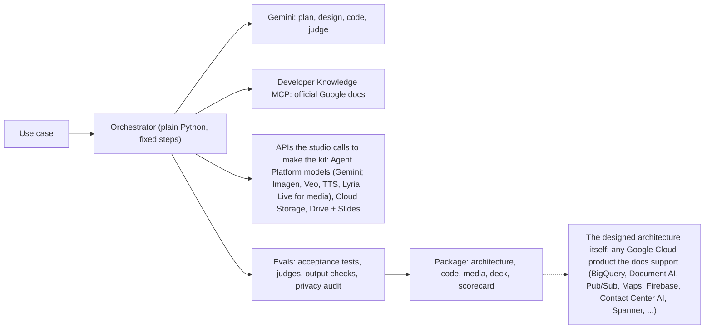
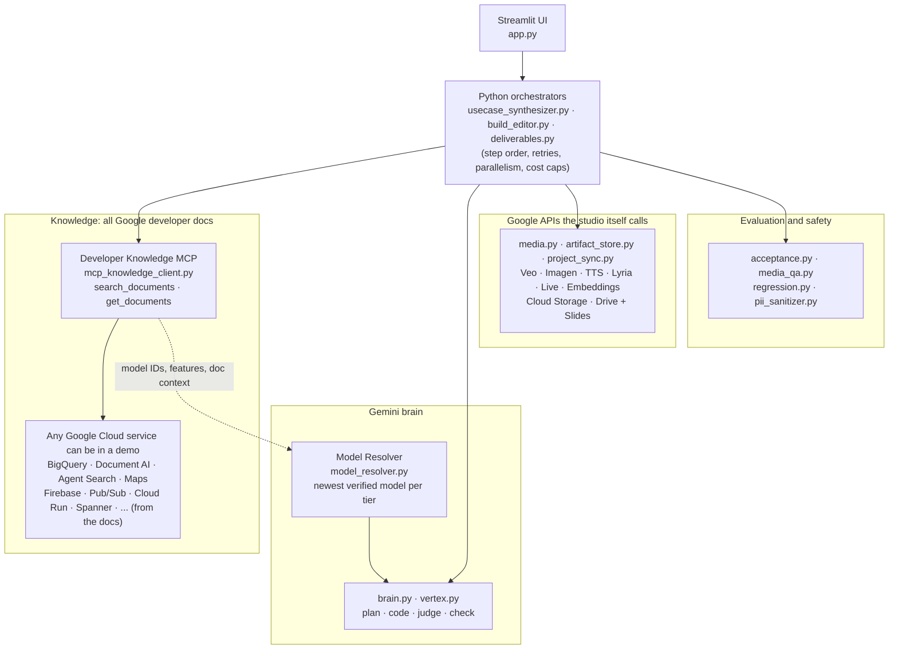

# Gemini + MCP Use-Case Studio

Turn a customer use case into a Google Cloud demo in 3 to 10 minutes (the built-in samples open instantly): a
grounded architecture, starter code, generated media, an editable deck and an eval scorecard.

**Author:** Layolin Jesudhass

## What you get

Type a use case, for example *"multilingual voice concierge for airline members"* or *"claims intake from
scanned forms"*. The studio returns:

- **Architecture**: each step mapped to a Google Cloud service and model, with the official doc behind every choice
- **Starter code**: a Python pipeline with its requirements and a README, packaged as a zip
- **Demo outputs**: videos, images, voice and music from Google's media models, or structured results, agent
  traces and chat demos (opened on a played, checked first reply, with charts) for non-media use cases
- **Story**: a hero, a challenge and a payoff, plus a presenter script
- **Deck**: five editable slides (story, the same architecture flow as the app's diagram with the demo outputs
  attached, deliverables, scorecard, package) with the talk track in the speaker notes; PowerPoint, or Google
  Slides when a Drive folder is set (on Cloud Run: a shared-drive folder)
- **Scorecard**: acceptance tests, judge scores and a privacy audit of the package
- **Chat**: ask questions or request changes ("add Korean", "shorten the video"), answered with doc citations

Naming: Google renamed Vertex AI to **Gemini Enterprise Agent Platform** ("Agent Platform"), Vertex AI Search to Agent Search and Agent Engine to Agent Runtime (release notes, mid-2026). The studio uses the current names everywhere, including in saved builds; APIs, roles and endpoints (`aiplatform.googleapis.com`) are unchanged.

Example presets cover enterprise search with citations, document processing, an analytics agent, a voice
concierge and generative media. One sidebar picker, **Open a demo**, lists the samples and then your saved builds.
**The samples are pre-built**: picking one opens a finished demo at once. They are
rebuilt in the background whenever the studio moves to a newer model, so they always show the models in use;
change the sample text in any way and the studio builds that new ask instead (a "Rebuild from scratch" button
rebuilds an unchanged one live). When only the slide layout changes, saved decks are redrawn from the stored
results in seconds, with no rebuild. Knobs: `PREBUILD_SAMPLES=false` turns this off, `PREBUILD_PARALLEL` (default
4) is how many samples build at once; `python -m engine.prebuild --status` lists which samples are current.

## How it works



**MCP for knowledge, direct APIs for execution.** The MCP server supplies official docs (grounding, model discovery, citations); the orchestrator calls Google APIs itself; models come from the self-upgrading resolver. No agent framework runs the studio: the steps are fixed, so code decides, not the model. ADK appears only inside generated demos that need an agent (support agents, voice concierges). Two lists not to confuse: the APIs above are what the **studio** calls; the **architecture it designs** for a use case can use any Google Cloud product (it is written into the code and the deck, and its outputs are demonstrated with Gemini and the media models rather than by deploying the customer's stack).

- **No hard-coded models**: the studio finds the newest models in Google's docs, verifies them in your project,
  tests them on a golden set and rolls back automatically if quality drops.
- **Grounded**: every service, model and package comes with an official Google doc link.
- **Checked**: every build is scored, and failing steps are retried.

The full architecture (modules, workflows, every eval rule, deployment) is in the [Architecture](#architecture) section at the end of this page.

## Deploy in three steps

**1. Prerequisites**

- The [gcloud CLI](https://cloud.google.com/sdk/docs/install), signed in: `gcloud auth login`
- A Google Cloud project with billing, where you are an Owner
- Access to the models you want to show: preview models such as Veo appear only if your project can call them
- Python 3.10 or later, only for local runs

**2. Clone and deploy.** The project ID is the only value you have to give; everything else has a default.

```bash
git clone https://github.com/LUJ20/eliminating-custom-demo-toil-with-google-mcp.git
cd eliminating-custom-demo-toil-with-google-mcp
./deploy.sh --project YOUR_PROJECT_ID
```

The script enables the APIs, creates the bucket and a service account with only the roles the app needs, builds
the container, deploys it to Cloud Run behind Identity-Aware Proxy (IAP) and prints the URL. It takes about 5
minutes. The values it used are saved in `.env` (never committed), so the next `./deploy.sh` needs no flags;
re-run it any time to update the app.

**3. Open the URL and pick a sample.** Only you can open the app at first. To let others in:

```bash
./deploy.sh --project YOUR_PROJECT_ID --allow user:NAME@example.com,group:TEAM@example.com
```

Each new instance spends a few minutes picking the newest models; open the app sooner and the first page waits
for that, once.

**Run on your laptop instead:** `./deploy.sh --local --project YOUR_PROJECT_ID` opens http://localhost:8502.

### Where to set what

| Setting | Easiest way | Also accepted |
| :--- | :--- | :--- |
| Google Cloud project | `--project YOUR_PROJECT_ID` | `GOOGLE_CLOUD_PROJECT` in `.env`, or your gcloud default project |
| Who can open the app | `--allow user:a@example.com,group:team@example.com` | `IAP_ALLOW` in `.env` |
| Bucket for packages and project backups | nothing: `YOUR_PROJECT_ID-gemini-mcp-studio` is created for you | `--bucket NAME` or `GCS_BUCKET` in `.env` |
| Google Drive folder (decks as Google Slides, scripts as Google Docs) | paste the folder link in the app's sidebar | `--drive-folder <folder link or ID>` or `DRIVE_FOLDER` in `.env`. On Cloud Run the folder must be in a **shared drive** with the service account `<service>@<project>.iam.gserviceaccount.com` added as Content manager (a service account has no My Drive storage); without it, decks are published to the bucket as `.pptx`. One-time setup, signed in as the account that uses the app: Drive → **Shared drives** → **New** (a shared drive, not a My Drive folder: its link ends in `/folders/0A…`, a My Drive folder's in `/folders/1…`) → **Manage members** → add the service account as **Content manager** → copy the link from the address bar |
| Cloud Run region, service name, instances kept warm | defaults `us-central1`, `gemini-mcp-studio`, `1` | `--region`, `--service`, `--min-instances`, or `CLOUD_RUN_REGION`, `CLOUD_RUN_SERVICE`, `CLOUD_RUN_MIN_INSTANCES` in `.env` |
| Agent Platform (model) location | default `global` | `--location` or `GOOGLE_CLOUD_LOCATION` in `.env` |
| Local port | default `8502` | `--port` |
| Eval thresholds, media limits, model policy | defaults | copy [.env.example](.env.example) to `.env` and edit; every knob is listed there with its default |

The sidebar also lets you switch the bucket, Drive folder and model mode for your own session without a
redeploy; the project is the one you deployed to. **Show output checks** (off by default) draws the checker's verdict under each demo output; the scorecard itself shows one status line and the rubric table, and the per-test inputs and outputs, the attempt history and the incident log stay in the build's `.studio_result.json`. `--min-instances 0` costs nothing when idle, but a cold instance takes a few minutes to resolve models.

## Costs and limits

This is a demo deployment, not a production service.

- One Cloud Run instance stays on (about $4 a day at list price), plus model usage for each build.
- Built projects are backed up to your bucket (`_projects/`) every minute and restored when the app starts, so
  they survive redeploys and restarts. To bring local projects along: `python -m engine.project_sync --push`.
- One instance serves a small team. A build takes 3 to 10 minutes; the pre-built samples open at once.
- Generated code is checked by evals but never executed by the studio. Run it in your own project before you
  show it live.

To remove the app: `gcloud run services delete gemini-mcp-studio --region us-central1`.

## Security

- Private by default: IAP admits only the accounts you allow.
- Runs as its own service account: Agent Platform User (`roles/aiplatform.user`), Service Usage Consumer, and object access to one bucket.
- `.env`, local projects and caches are never uploaded (see `.gcloudignore`).
- Packages are scanned for secrets and personal data before they are published.

## Architecture

### 1. Core Architectural Pattern

The codebase uses a **deterministic Python orchestrator** pattern (`Orchestrator → Gemini Brain + MCP Knowledge + Direct Google API Tools`) rather than an open-ended autonomous tool-calling loop:



Two different lists, on purpose. **What a demo can use** is open: the planner picks services for the customer's ask from the official docs (a delivery demo gets Maps, Fleet Engine and Firebase; an analytics demo gets BigQuery), so coverage is everything Google documents. It is Google Cloud only by default: a stage on another vendor's service, a bare protocol or a client platform is accepted only when the ask names it (and the card says so); a customer's own app is modelled by the Google Cloud service it calls. **What the studio itself calls** is deliberately small: Gemini to think, the media models to make demo assets, Cloud Storage and Drive to keep and publish them. The studio designs, writes and evaluates the demo; it does not run the customer's services (generated code is never executed), so it needs no credentials for them.

**When a use case needs a call outside that list**, each stage is handled by its kind, automatically:

| The stage is… | What you get | Example |
| :--- | :--- | :--- |
| AI work a model the studio calls can do (answering, extraction, chat, retrieval, images, video, voice, music) | Designed, coded **and demonstrated live** on the real model, with its checks | Gemini extracts the fields of a synthetic claim; Veo renders the campaign clip |
| A Google service doing non-AI work (BigQuery, Pub/Sub, Maps, Firestore, a Document AI processor) | Designed with its official doc, **real code** against that API in the package, and a **stand-in output** made by Gemini for the demo (table, JSON, agent trace, text), schema- and brief-checked | A BigQuery stage ships the SQL and client code; the demo shows the result table and a chart |
| Something no model can stand in for (the customer's own data, a running deployed app, a capability with no tier) | Still in the architecture, docs and code; the demo output is a description or trace, and the scorecard shows it as not demonstrated | "Deploy to Cloud Run" ships the Dockerfile and command, not a live endpoint |
| Questions over documents | One document up to 1,000 pages / 50 MB needs no index: Gemini reads it whole (each page as text and image, so charts and figures are answerable) behind a context cache. A corpus of many such documents is a **retrieval** design: the package code builds the index (Agent Search data store or RAG Engine corpus: layout parser, chunking, embeddings; figures described at ingest so they are searchable) and asks Gemini with the retrieval tool; the demo chat answers from a synthetic slice of the corpus | Field-manual Q&A over 3,000 manuals: the package ships the data-store creation, the Cloud Storage import and the grounded chat; the demo answers from sample manual pages |

Nothing fails and the gap is visible. Extending the studio is additive: a new capability is a new tier in `model_resolver.py` (models are still discovered from the docs) plus a generator in `media.py`; executing demos for real against customer services is the optional sandbox-job / managed-MCP step in the production plan.

#### Design Responsibilities
| Layer | Implementation | Responsibility |
| :--- | :--- | :--- |
| **Orchestrator** | `engine/usecase_synthesizer.py`, `engine/build_editor.py`, `engine/deliverables.py` | Controls step ordering, retry loops, concurrency limits, cost caps, and fallbacks. |
| **Knowledge (MCP)** | `engine/mcp_knowledge_client.py` | Queries Google Developer Knowledge MCP (`search_documents`, `get_documents`) so every service, model ID, feature, package, and citation is grounded in official docs. |
| **Brain (Gemini)** | `engine/brain.py`, `engine/vertex.py` | Generates architecture plans, starter code, judge scores, QA verdicts, acceptance tests, and chat edit plans as validated JSON. |
| **Model Resolver** | `engine/model_resolver.py` | Dynamically discovers, verifies, canary-tests, monitors, and rolls back models across 11 capability tiers (zero hardcoded model IDs). |
| **Direct Tools** | `engine/media.py`, `engine/artifact_store.py`, `engine/project_sync.py` | Invokes Agent Platform media APIs, Cloud Storage, and Google Drive/Slides/Docs directly from Python. |


### 2. Directory & Module Layout

```text
Gemini+MCP/
├── app.py                          # Streamlit web UI (use-case input, one Open-a-demo picker: pre-built samples + saved builds, 5 result sections, build chat)
├── deploy.sh                       # One-command Cloud Run + IAP deployment or local launch (--local)
├── Dockerfile                      # Container build definition (runs python -m engine.serve)
├── requirements.txt                # Runtime Python dependencies
├── engine/                         # Core application backend
│   ├── serve.py                    # Cloud Run entrypoint: model warm-up + project sync + sample pre-build + Streamlit
│   ├── config.py                   # Settings, policy thresholds, and credential resolution (.env / gcloud / ADC)
│   ├── common.py                   # Shared utilities: atomic locked JSON/JSONL I/O, retries, text helpers
│   ├── mcp_knowledge_client.py     # HTTP/JSON-RPC client for Google Developer Knowledge MCP server
│   ├── vertex.py                   # Agent Platform REST calls (generateContent, predict, embeddings, model probes)
│   ├── model_resolver.py           # Self-upgrading model discovery, verification, golden set, canary & rollback
│   ├── troubleshooter.py           # Error classification, safe auto-remediation, model fallback, incident logs
│   ├── brain.py                    # System prompts and JSON schema validators for planner, codegen, judge, director
│   ├── usecase_synthesizer.py      # End-to-end build pipeline orchestrator (plan → code → judge, checks overlapped)
│   ├── samples.py                  # The 8 sample use cases shown in the sidebar (one source for UI and pre-builder)
│   ├── prebuild.py                 # Pre-builds the samples; rebuilds them when a newer model is in use
│   ├── manifest.py                 # Deliverables manifest schema, output kinds, tiers, and contracts
│   ├── deliverables.py             # Background parallel deliverable generation and retry loop (chats: direct → play → check → replay)
│   ├── media.py                    # Agent Platform media generators (Veo video, Imagen/Gemini image, TTS, Lyria music) and chat turns
│   ├── media_qa.py                 # Per-deliverable quality checker, critic feedback, and best-attempt selector
│   ├── charts.py                   # Splits a chat reply into markdown, code and ```chart CSV blocks the UI draws as line charts
│   ├── acceptance.py               # End-to-end use-case acceptance test planner, runner, and evaluator
│   ├── regression.py               # Post-upgrade regression runner against reference use cases
│   ├── dependency_resolver.py      # PyPI/MCP-grounded package name & version verifier for requirements.txt
│   ├── pii_sanitizer.py            # Secret and PII scanner/redactor for generated code and packages
│   ├── deck_generator.py           # 5-slide PowerPoint (.pptx) and Google Slides generator
│   ├── slide_viewer.py             # HTML/SVG slide preview renderer for the Streamlit UI
│   ├── story_doc.py                # Narrative arc and presenter talk-track generator (.html / Google Doc)
│   ├── artifact_store.py           # Publisher for Google Drive folders and Cloud Storage buckets
│   ├── project_sync.py             # Bidirectional background sync between generated_projects/ and GCS (_projects/)
│   ├── build_editor.py             # Interactive post-build chat assistant (grounded Q&A + build mutations)
│   ├── code_editor.py              # Chat-driven code modifier with re-validation, re-judging, and diffing
│   └── versions.py                 # Snapshot manager for Undo, Save, and Discard across chat edits
├── evals/
│   ├── reference_cases.json        # 4 canonical use cases for model upgrade regression testing
│   └── chat_intents.json           # 36 benchmark prompts for testing chat intent classification
├── scripts/
│   ├── eval_chat_intents.py        # CLI runner for the chat intent evaluation benchmark
│   └── make_studio_assets.py       # Generator for architecture diagrams and overview slide deck
├── tests/                          # Offline unit test suite (fakes-driven, no live cloud calls required)
└── docs/                           # Detailed PRD, eval rules, model upgrade rules, and Cloud Run plan
```


### 3. End-to-End Workflows

#### 3.1 Build Pipeline (`engine/usecase_synthesizer.py`)
1. **Grounding**: Queries `McpKnowledgeClient` (`search_documents` and `get_documents`) for official Google Cloud docs matching the customer use case (in parallel with the model catalog read).
2. **Model Catalog**: Fetches the active verified model per capability tier from `ModelResolver`.
3. **Architecture & Story Planning**: Uses the `reasoning` tier (`brain.py`) to design pipeline stages, story scenes (hero, challenge, payoff), and a deliverables manifest (`manifest.py`).
4. **Parallel Deliverable Generation**: As soon as the first valid plan is produced, `deliverables.py` launches background generation (up to 6 outputs in parallel) across video, image, speech, music, structured JSON/tables, agent traces, text, and chat demos. A chat demo is made like any other output: the director writes its system instruction with a **Context** section (the scene's facts and the hero's records) and a chart rule, the opener is played once against the real model, the first reply is saved (`.md`) and checked on the transcript, and a rejected reply is played again with the reviewer's findings appended to the instruction. The UI opens the chat with that first exchange in place, draws any fenced `chart` CSV block as a line chart (`charts.py`), and can play the first reply again.
5. **Acceptance Tests Start Early**: At that same first plan, `acceptance.py` plans 3–6 use-case-specific tests and runs them (6 in parallel) in the background against the design's models, overlapping code generation and judging instead of running after them. A test run is keyed by the design (stages, services, features, story), so a retry that keeps the design reuses it.
6. **Code Generation & Packaging**: Uses the `fast` tier to generate `pipeline.py` (with `--dry-run` support) while citations are attached in parallel, resolves dependencies via `DependencyResolver` (in parallel with the judge), and scans all files for secrets/PII with `PIISanitizer`.
7. **Scorecard & Retry Loop**: Evaluates the build using 5 LLM judge rubric rows and 6–7 programmatic checks, retrying up to 3 attempts with critic feedback. A retry whose design passed every check keeps the whole blueprint and rewrites only the code, so generated media and running acceptance tests carry over; only a design-level failure re-plans.
8. **Deck, Story & Publishing**: Generates the five-slide deck (`deck_generator.py`: story or overview, the architecture flow, deliverables, proof, package; the talk track in the speaker notes; stamped with `DECK_VERSION`) and `.zip` archive in parallel, the presenter script (`story_doc.py`), then publishes artifacts via `ArtifactStore` to Google Drive or Cloud Storage. The architecture slide is the same picture as the app's diagram (`app.py` `build_architecture_dot`): one row of stage boxes coloured by tier (two rows above six stages), a dashed "Demo output" group with one card per output attached to the last stage by dashed connectors, the outcome, and a "What each stage does" strip; every shape stays editable, and `slide_viewer.py` draws the connectors and dashed borders in the in-app player. On Cloud Run the service account publishes to Drive with a Drive-scoped token (metadata server, or IAM Credentials as a fallback), so Google Slides works there too when the folder is in a shared drive.

Typical wall time: about 3 minutes for a data/agent use case, 8–10 minutes when the demo includes several video clips.

#### 3.2 Pre-Built Samples (`engine/samples.py`, `engine/prebuild.py`)
1. **One source of truth**: the 8 sidebar samples live in `samples.py`; `app.py` and the pre-builder read the same list.
2. **Built ahead of time**: at start (local app or Cloud Run container, after the bucket restore and once models are resolved) every sample whose saved project is missing or stale is built as a normal build, `PREBUILD_PARALLEL` (default 4) at once, under a per-project lock so two triggers never build twice. Finished projects reach the bucket through `project_sync.py`.
3. **Staleness rules**: a saved project stands in for an ask only when it is a finished build of exactly that customer and text (whitespace aside), in the same mode, on the models in use now, by the current studio generation (`BUILD_GENERATION` in `usecase_synthesizer.py`, stamped into every result: bump it when every sample should be rebuilt on the next start, for example after a new kind of deliverable). The Model Resolver's promotion hook (registered after the regression hook, so a rollback comes first) rebuilds the samples a newer model made stale.
4. **In the UI**: one sidebar picker, "Open a demo", lists `Custom`, the 8 samples and then every other saved build (newest first; a saved build of a sample's exact ask is reached through the sample's entry, never listed twice). Picking a sample opens its pre-built demo instantly; a sample built on older models or in the other mode still opens, with the caption "Built on older models; Create Custom Demo rebuilds it."; a sample not built yet only fills the form; picking a saved build loads it with its scorecard, outputs, chat and versions; `Custom` clears the form. Submitting unchanged text opens the saved demo (with a "Rebuild from scratch" button); any edit to the text builds fresh; a sample being pre-built right now is joined, not built twice. The picker keeps its selection when a new build appears in the list (an `on_change` callback records the choice, so a widget reset never clears the form).
5. **Deck refresh without a rebuild**: a change to the slides alone (a bumped `DECK_VERSION`) does not make a sample stale. At start, before the pre-build, and whenever a saved build is opened, `build_editor.refresh_deck` redraws any deck made by an older layout from the stored result (`.studio_result.json`): about half a second per project, no model call, under the same build lock as the synthesizer. `versions.py` treats the deck as derived, so a redrawn deck is never an "unsaved change". CLI: `python -m engine.prebuild --decks`.
6. **Chat refresh without a rebuild**: after the pre-build, `prebuild.refresh_chats` sweeps every saved project whose chat demo has no played first reply (builds from before chats were played) and calls `deliverables.redirect`: the chat is directed again, its opener played and the reply checked, about a minute per project on the models in use. The deliverables folder is volatile for `versions.py`, so this is not an "unsaved change" either. CLI: `python -m engine.prebuild --chats`.

#### 3.3 Self-Upgrading Model Resolver (`engine/model_resolver.py`)
1. **Discover**: Scans Google Developer Knowledge MCP documentation for candidate model IDs across 11 tiers (`reasoning`, `fast`, `lite`, `live`, `image`, `image_fast`, `video`, `video_fast`, `music`, `speech`, `embedding`).
2. **Verify**: Checks availability in Model Garden and runs a live probe call.
3. **Gate (Golden Set & Canaries)**:
   - Text tiers run a 9-task role-based golden benchmark (must score $\ge 7/9$, match or beat current champion, and stay within $2\times$ latency).
   - Media and embedding tiers run modality-specific quality canaries.
4. **Promote, Regression Check & Sample Refresh**: On promotion, triggers `regression.py` across the 4 reference use cases in `evals/reference_cases.json`, then `prebuild.py` rebuilds the sample demos that used the replaced model (hooks run in order, so a rollback happens before any sample is rebuilt).
5. **Runtime Watch & Rollback**: Tracks a sliding window of the last 8 calls per model (ignoring environment/credential/HTTP 429 errors via `Troubleshooter`). If model quality or reliability degrades, automatically rolls back to the previous champion and quarantines the failing model for 24 hours.

#### 3.4 Post-Build Chat & Versioning (`engine/build_editor.py`)
1. **Context Assembly**: Combines up to 8 MCP documentation pages with full build facts (scores, rubric reasons, chosen models, story scenes, deliverables, and QA checks).
2. **Intent Classification**: Routes user input into one of three paths:
   - **Question**: Generates a grounded answer and runs a citation verification check (retrying once if a claim is unsupported by the cited doc).
   - **Build Change** (outputs, docs, or code): Takes a snapshot via `versions.py`, applies the requested edits (regenerating only modified deliverables or running `code_editor.py` with full re-judging and diff generation), and runs a change-completion check (`done` / `partly` / `not done`).
   - **Refusal**: Blocks out-of-policy requests (e.g., using unverified models, disabling security checks, exceeding cost caps) with a clear explanation.


### 4. Evaluation: every rule, rubric and threshold

Every build, demo output, chat change and model upgrade is evaluated. Thresholds are environment variables (names in brackets); judges are Gemini models from the `reasoning` tier, and every rule with a programmatic check is enforced by code, not by a judge.

#### 4.1 When evals run

| Event | Evals |
| :--- | :--- |
| A build | Build scorecard (up to 3 attempts; a code-only retry keeps a passing design) · acceptance tests, started with the first valid plan and run alongside code generation and judging (6 at a time) · output checks on every demo output |
| A sample pre-build (app start, model promotion) | The same evals as a build: the saved samples are real builds |
| A chat message | Question: citation check. Change: validation → change check (code changes are also re-judged) |
| Daily model refresh | Promotion canary for new models · drift check on current models |
| Every model call | Runtime watch (errors, invalid outputs, failed output checks) |
| After a model upgrade | Regression suite on the reference use cases, then the sample demos are rebuilt on the new models |
| Before a release | Chat intent set (`scripts/eval_chat_intents.py`) · offline unit tests (`python -m unittest discover -s tests`) |

#### 4.2 Build scorecard — is the design and code right? (`engine/brain.py`, `engine/usecase_synthesizer.py`)

| Rule | Pass |
| :--- | :--- |
| R1 Judge rubric: requirement coverage · grounded in official docs · code implements the design · demo shows what was asked · demo tells a story | Judge score **4/5 or better** on each row [`EVAL_MIN_JUDGE_SCORE`] |
| R2 Model currency | Every AI stage uses the newest verified model of its tier |
| R3 Feature showcase (AI stages only) | The showcased model features are configured in the code |
| R4 Doc citations | Every stage cites an official Google doc |
| R5 Code validity | `pipeline.py` compiles and has a `--dry-run` entry point |
| R6 Dependencies | Every import is documented in an official Google doc |
| R7 Security / PII | 0 findings after redaction |
| R8 Standard parameters | Project placeholder, location, models map; no model IDs in code |
| R9 Use case works end to end | **80 % or more** of the acceptance tests pass and no safety failure [`ACCEPTANCE_MIN_PASS`] |
| R10 Google Cloud only (plan time) | Every stage runs on a specific Google Cloud product (never just "Google Cloud"). Another vendor's service, a bare protocol or a client platform (AWS, Twilio, WebRTC, Android…) is accepted only when the ask or the customer names it; the stage card then says so. A plan that breaks this is sent back to the planner with the reason |
| R11 Short stage cards (plan time) | Stage name 2–3 words, API 2–5 words, description one plain 8–14 word sentence; a plan over the caps (4 words / 32 characters, 8 words, 20 words) is sent back |

**Score** = mean of the rows (judge rows as score/5, checks as 1 or 0). **PASSED** = every row passes. Otherwise up to 3 attempts [`EVAL_MAX_ATTEMPTS`] with the failed rows fed back as fixes; the best attempt is kept as **BEST EFFORT**. R10 and R11 are checked when the plan is parsed, so they never reach the scorecard: the planner re-answers until they hold.

#### 4.3 Acceptance tests — does the use case actually work? (`engine/acceptance.py`)

| Rule | Pass |
| :--- | :--- |
| A1 3–6 tests written from the ask, every requirement covered [`ACCEPTANCE_MAX_TESTS`] | Valid tests, each tied to a requirement and a stage |
| A2 Each test runs on the build's own stage model | A valid output in the contract for its type |
| A3 Checks by type: answer (facts, citations support the claims) · structured (schema) · agent (right tools, right order, nothing forbidden) · retrieval (expected source in the top 3) · classification (right label) · translation (language) · conversation and generation (facts) · all (safe, on task) | All critical checks pass |

Acceptance tests run the **design** (stages + chosen models), not the generated code.

#### 4.4 Demo outputs — is each output right? (`engine/media_qa.py`)

| Output | Critical checks | Soft checks |
| :--- | :--- | :--- |
| Video | language, script, lip-sync, same person, brand safe, on-screen text | matches prompt, plays the scene |
| Image | brand safe, on-screen text | matches prompt, plays the scene |
| Speech | language, script, brand safe | plays the scene |
| Music | brand safe | mood, plays the scene |
| Text | written language, matches the brief, brand safe | plays the scene |
| Chat (opener + played first reply) | written language, matches the brief (answers from its Context, never asks for data, charts a trend), brand safe | plays the scene |
| Table / JSON result | schema valid, matches the brief, written language, brand safe | plays the scene |
| Agent trace | schema valid, matches the brief, plausible steps, safe actions, brand safe | plays the scene |

A critical failure regenerates the output with the findings, up to 2 more rounds [`MEDIA_RETRIES`], best kept (a chat is played again with the findings appended to its system instruction). The live **Demo output quality** row = all outputs pass their critical checks; with the sidebar switch **Show output checks** on, each output also shows one collapsed "Checks: n/m passed" line with the reviewer's summary (off by default; a failed check still highlights that output's Regenerate button).

#### 4.5 Chat — is the answer or change right? (`engine/build_editor.py`)

| Rule | Pass |
| :--- | :--- |
| C1 Questions are answered from build facts + official docs, with citations | Every citation number exists |
| C2 Citation support | Each cited doc supports its sentence; otherwise one retry, then marked unverified |
| C3 Changes are validated like a build | Valid manifest, no unverified models, under the media cap |
| C4 Change check | "done / partly / not done" compared with the request, shown in the reply |
| C5 Code changes | Re-validated, PII + dependencies re-scanned, re-judged, re-scored; diff shown |
| C6 Refusals | Studio changes, unverified models, disabling security, over the cost cap |
| C7 Intent test set (36 requests across all use-case types) | 90 % or more routed correctly as question / change / refusal |

#### 4.6 Model upgrades — is a new model at least as good, and does it stay good? (`engine/model_resolver.py`, `engine/regression.py`)

| Rule | Pass |
| :--- | :--- |
| M1 Found in official docs and callable in your project | Listed in Model Garden and a probe call answers |
| M2 Text models: 9-task golden set by role (plan JSON, code, grounded answer, judge flags a defect, judge accepts good code, checker catches the wrong language, tool use, citation faithfulness, story plan); scored by code | **7 of 9 or better** and at least the current model's score; p50 latency at most 2× [`PROMOTE_MIN_SCORE`, `PROMOTE_MAX_LATENCY_RATIO`] |
| M3 Embedding, image, video, speech, music models: quality canary, run only when a new model would replace the current one | Embedding: paraphrases closer than unrelated text (+0.05). Image / speech / music / video: a real sample of the right type and size; a bad sample is not retried for 72 h [`MEDIA_CANARY`, `MEDIA_CANARY_VIDEO`] |
| M4 Daily drift check (text models) | At most 1 golden task lower than at promotion [`DRIFT_TOLERANCE`] |
| M5 Runtime watch (all models) | Over the last 8 calls: error rate below 50 % and quality 0.6 or better, where failed output checks count as bad quality; credential, network, project-setup and rate-limit (429) errors are ignored [`ROLLBACK_*`] |
| M6 Regression suite after an upgrade (4 reference use cases: voice/avatar, RAG search, agent + data, document extraction) | No case drops more than 10 points and no row that passed now fails [`REGRESSION_MAX_DROP`] |

On failure the model is **held** (not promoted) or **rolled back** to the last known good one and **quarantined for 24 h** [`QUARANTINE_HOURS`]. If the older model fails the same task the same way, the newer one is restored (the task is at fault, not the model). If every regression build errors, the result is inconclusive and nothing is rolled back.

#### 4.7 Rules that always apply, and known limits

1. No hard-coded model IDs anywhere; models come from the resolver and generated code reads them from config.
2. Environment failures (expired credentials, network, disabled API, permissions, rate limits) never count against a model.
3. Every model change is logged with its reason and metrics.
4. Model output is treated as untrusted: escaped in the UI, validated before use; generated code is checked, never executed (running it in an isolated Cloud Run job is the next step).
5. Judges and checkers are AI models and can be wrong; the rules with a programmatic check are the most reliable. The Live API model is availability-checked and its latency recorded; there is no conversation canary yet.

### 5. Deployment & Persistence Architecture

* **Local Mode** (`./deploy.sh --local`): Runs Streamlit on `localhost:8502` using local `gcloud` user credentials and optional Google Drive publishing (`--drive-folder`). The app pre-builds the missing or stale samples in the background on its first page load.
* **Cloud Run Mode** (`./deploy.sh --project <ID>`):
  - Provisions required GCP APIs, a dedicated least-privilege service account (`gemini-mcp-studio`), and a Cloud Storage bucket (`<project>-gemini-mcp-studio`).
  - Deploys the container to Cloud Run behind **Identity-Aware Proxy (IAP)** so only authorized users/groups can access the studio.
  - `engine/serve.py` warms up the model registry in `.cache/` on startup, runs `engine/project_sync.py` in a background daemon thread to restore and back up `generated_projects/` to `gs://<bucket>/_projects/` every 60 seconds, and then starts `engine/prebuild.py` (after the restore and once models are resolved) so a fresh instance fills in whatever samples the bucket did not have, without waiting for a visitor; the same thread then redraws old decks and plays the first reply of any chat demo that has none.
* **Knobs**: `PREBUILD_SAMPLES` (default `true`) turns the pre-build off; `PREBUILD_PARALLEL` (default 4) is how many samples build at once; `python -m engine.prebuild --status` reports which samples are current, `--force` rebuilds all, `--push` uploads them to the bucket, `--decks` only redraws the decks of saved projects for a new slide layout, `--chats` only re-directs and plays the chat demos that have no first reply yet.

Offline unit tests: `python -m unittest discover -s tests` (387 tests, about 5 seconds, no cloud calls). CI (`.github/workflows/ci.yml`) runs the same suite plus a `bash -n deploy.sh` syntax check on every push and pull request, with the actions pinned to commit hashes and a read-only token.
