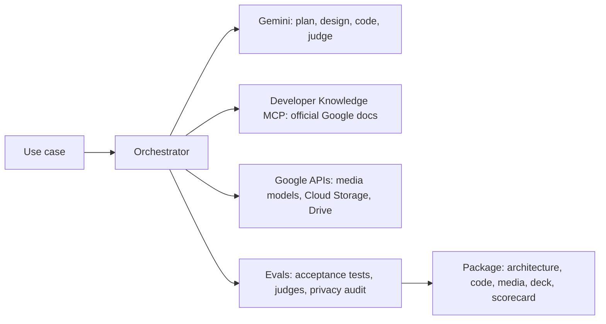
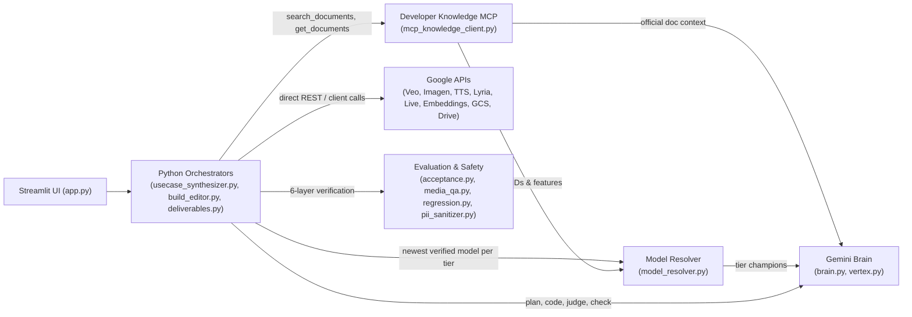

# Gemini + MCP Use-Case Studio

Turn a customer use case into a Google Cloud demo in 3 to 10 minutes (the built-in samples open instantly): a
grounded architecture, starter code, generated media, an editable deck and an eval scorecard.

**Author:** Layolin Jesudhass

## What you get

Type a use case, for example *"multilingual voice concierge for airline members"* or *"claims intake from
scanned forms"*. The studio returns:

- **Architecture**: each step mapped to a Google Cloud service and model, with the official doc behind every choice
- **Starter code**: a Python pipeline with its requirements and a README, packaged as a zip
- **Demo outputs**: videos, images, voice and music from Google's media models, or structured results, agent
  traces and chat demos (opened on a played, checked first reply, with charts) for non-media use cases
- **Story**: a hero, a challenge and a payoff, plus a presenter script
- **Deck**: five editable slides (story, architecture flow diagram, deliverables, scorecard, package) with the talk
  track in the speaker notes; PowerPoint, or Google Slides when run locally with Drive
- **Scorecard**: acceptance tests, judge scores and a privacy audit of the package
- **Chat**: ask questions or request changes ("add Korean", "shorten the video"), answered with doc citations

Example presets cover enterprise search with citations, document processing, an analytics agent, a voice
concierge and generative media. **The samples are pre-built**: picking one opens a finished demo at once. They are
rebuilt in the background whenever the studio moves to a newer model, so they always show the models in use;
change the sample text in any way and the studio builds that new ask instead (a "Rebuild from scratch" button
rebuilds an unchanged one live). When only the slide layout changes, saved decks are redrawn from the stored
results in seconds, with no rebuild. Knobs: `PREBUILD_SAMPLES=false` turns this off, `PREBUILD_PARALLEL` (default
4) is how many samples build at once; `python -m engine.prebuild --status` lists which samples are current.

## How it works



- **No hard-coded models**: the studio finds the newest models in Google's docs, verifies them in your project,
  tests them on a golden set and rolls back automatically if quality drops.
- **Grounded**: every service, model and package comes with an official Google doc link.
- **Checked**: every build is scored, and failing steps are retried.

The full architecture (modules, workflows, the six eval layers, deployment) is in the [Architecture](#architecture) section at the end of this page.

## Deploy in three steps

**1. Prerequisites**

- The [gcloud CLI](https://cloud.google.com/sdk/docs/install), signed in: `gcloud auth login`
- A Google Cloud project with billing, where you are an Owner
- Access to the models you want to show: preview models such as Veo appear only if your project can call them
- Python 3.10 or later, only for local runs

**2. Clone and deploy.** The project ID is the only value you have to give; everything else has a default.

```bash
git clone https://github.com/cloud-gtm/eliminating-custom-demo-toil-with-google-mcp.git
cd eliminating-custom-demo-toil-with-google-mcp
./deploy.sh --project YOUR_PROJECT_ID
```

The script enables the APIs, creates the bucket and a service account with only the roles the app needs, builds
the container, deploys it to Cloud Run behind Identity-Aware Proxy (IAP) and prints the URL. It takes about 5
minutes. The values it used are saved in `.env` (never committed), so the next `./deploy.sh` needs no flags;
re-run it any time to update the app.

**3. Open the URL and pick a sample.** Only you can open the app at first. To let others in:

```bash
./deploy.sh --project YOUR_PROJECT_ID --allow user:NAME@example.com,group:TEAM@example.com
```

Each new instance spends a few minutes picking the newest models; open the app sooner and the first page waits
for that, once.

**Run on your laptop instead:** `./deploy.sh --local --project YOUR_PROJECT_ID` opens http://localhost:8502.

### Where to set what

| Setting | Easiest way | Also accepted |
| :--- | :--- | :--- |
| Google Cloud project | `--project YOUR_PROJECT_ID` | `GOOGLE_CLOUD_PROJECT` in `.env`, or your gcloud default project |
| Who can open the app | `--allow user:a@example.com,group:team@example.com` | `IAP_ALLOW` in `.env` |
| Bucket for packages and project backups | nothing: `YOUR_PROJECT_ID-gemini-mcp-studio` is created for you | `--bucket NAME` or `GCS_BUCKET` in `.env` |
| Google Drive folder (decks as Google Slides, scripts as Google Docs) | paste the folder link in the app's sidebar | `--drive-folder <folder link or ID>` or `DRIVE_FOLDER` in `.env` (local runs) |
| Cloud Run region, service name, instances kept warm | defaults `us-central1`, `gemini-mcp-studio`, `1` | `--region`, `--service`, `--min-instances`, or `CLOUD_RUN_REGION`, `CLOUD_RUN_SERVICE`, `CLOUD_RUN_MIN_INSTANCES` in `.env` |
| Vertex AI location | default `global` | `--location` or `GOOGLE_CLOUD_LOCATION` in `.env` |
| Local port | default `8502` | `--port` |
| Eval thresholds, media limits, model policy | defaults | copy [.env.example](.env.example) to `.env` and edit; every knob is listed there with its default |

The sidebar also lets you switch the project, bucket, Drive folder and model mode for your own session without a
redeploy. `--min-instances 0` costs nothing when idle, but a cold instance takes a few minutes to resolve models.

## Costs and limits

This is a demo deployment, not a production service.

- One Cloud Run instance stays on (about $4 a day at list price), plus model usage for each build.
- Built projects are backed up to your bucket (`_projects/`) every minute and restored when the app starts, so
  they survive redeploys and restarts. To bring local projects along: `python -m engine.project_sync --push`.
- One instance serves a small team. A build takes 3 to 10 minutes; the pre-built samples open at once.
- Generated code is checked by evals but never executed by the studio. Run it in your own project before you
  show it live.

To remove the app: `gcloud run services delete gemini-mcp-studio --region us-central1`.

## Security

- Private by default: IAP admits only the accounts you allow.
- Runs as its own service account: Vertex AI User, Service Usage Consumer, and object access to one bucket.
- `.env`, local projects and caches are never uploaded (see `.gcloudignore`).
- Packages are scanned for secrets and personal data before they are published.

## Architecture

### 1. Core Architectural Pattern

The codebase uses a **deterministic Python orchestrator** pattern (`Orchestrator → Gemini Brain + MCP Knowledge + Direct Google API Tools`) rather than an open-ended autonomous tool-calling loop:



#### Design Responsibilities
| Layer | Implementation | Responsibility |
| :--- | :--- | :--- |
| **Orchestrator** | `engine/usecase_synthesizer.py`, `engine/build_editor.py`, `engine/deliverables.py` | Controls step ordering, retry loops, concurrency limits, cost caps, and fallbacks. |
| **Knowledge (MCP)** | `engine/mcp_knowledge_client.py` | Queries Google Developer Knowledge MCP (`search_documents`, `get_documents`) so every service, model ID, feature, package, and citation is grounded in official docs. |
| **Brain (Gemini)** | `engine/brain.py`, `engine/vertex.py` | Generates architecture plans, starter code, judge scores, QA verdicts, acceptance tests, and chat edit plans as validated JSON. |
| **Model Resolver** | `engine/model_resolver.py` | Dynamically discovers, verifies, canary-tests, monitors, and rolls back models across 11 capability tiers (zero hardcoded model IDs). |
| **Direct Tools** | `engine/media.py`, `engine/artifact_store.py`, `engine/project_sync.py` | Invokes Vertex AI media APIs, Cloud Storage, and Google Drive/Slides/Docs directly from Python. |


### 2. Directory & Module Layout

```text
Gemini+MCP/
├── app.py                          # Streamlit web UI (use-case input, pre-built samples, saved projects, 5 result sections, build chat)
├── deploy.sh                       # One-command Cloud Run + IAP deployment or local launch (--local)
├── Dockerfile                      # Container build definition (runs python -m engine.serve)
├── requirements.txt                # Runtime Python dependencies
├── engine/                         # Core application backend
│   ├── serve.py                    # Cloud Run entrypoint: model warm-up + project sync + sample pre-build + Streamlit
│   ├── config.py                   # Settings, policy thresholds, and credential resolution (.env / gcloud / ADC)
│   ├── common.py                   # Shared utilities: atomic locked JSON/JSONL I/O, retries, text helpers
│   ├── mcp_knowledge_client.py     # HTTP/JSON-RPC client for Google Developer Knowledge MCP server
│   ├── vertex.py                   # Vertex AI REST calls (generateContent, predict, embeddings, model probes)
│   ├── model_resolver.py           # Self-upgrading model discovery, verification, golden set, canary & rollback
│   ├── troubleshooter.py           # Error classification, safe auto-remediation, model fallback, incident logs
│   ├── brain.py                    # System prompts and JSON schema validators for planner, codegen, judge, director
│   ├── usecase_synthesizer.py      # End-to-end build pipeline orchestrator (plan → code → judge, checks overlapped)
│   ├── samples.py                  # The 8 sample use cases shown in the sidebar (one source for UI and pre-builder)
│   ├── prebuild.py                 # Pre-builds the samples; rebuilds them when a newer model is in use
│   ├── manifest.py                 # Deliverables manifest schema, output kinds, tiers, and contracts
│   ├── deliverables.py             # Background parallel deliverable generation and retry loop (chats: direct → play → check → replay)
│   ├── media.py                    # Vertex AI media generators (Veo video, Imagen/Gemini image, TTS, Lyria music) and chat turns
│   ├── media_qa.py                 # Per-deliverable quality checker, critic feedback, and best-attempt selector
│   ├── charts.py                   # Splits a chat reply into markdown, code and ```chart CSV blocks the UI draws as line charts
│   ├── acceptance.py               # End-to-end use-case acceptance test planner, runner, and evaluator
│   ├── regression.py               # Post-upgrade regression runner against reference use cases
│   ├── dependency_resolver.py      # PyPI/MCP-grounded package name & version verifier for requirements.txt
│   ├── pii_sanitizer.py            # Secret and PII scanner/redactor for generated code and packages
│   ├── deck_generator.py           # 5-slide PowerPoint (.pptx) and Google Slides generator
│   ├── slide_viewer.py             # HTML/SVG slide preview renderer for the Streamlit UI
│   ├── story_doc.py                # Narrative arc and presenter talk-track generator (.html / Google Doc)
│   ├── artifact_store.py           # Publisher for Google Drive folders and Cloud Storage buckets
│   ├── project_sync.py             # Bidirectional background sync between generated_projects/ and GCS (_projects/)
│   ├── build_editor.py             # Interactive post-build chat assistant (grounded Q&A + build mutations)
│   ├── code_editor.py              # Chat-driven code modifier with re-validation, re-judging, and diffing
│   └── versions.py                 # Snapshot manager for Undo, Save, and Discard across chat edits
├── evals/
│   ├── reference_cases.json        # 4 canonical use cases for model upgrade regression testing
│   └── chat_intents.json           # 36 benchmark prompts for testing chat intent classification
├── scripts/
│   ├── eval_chat_intents.py        # CLI runner for the chat intent evaluation benchmark
│   └── make_studio_assets.py       # Generator for architecture diagrams and overview slide deck
├── tests/                          # Offline unit test suite (fakes-driven, no live cloud calls required)
└── docs/                           # Detailed PRD, eval rules, model upgrade rules, and Cloud Run plan
```


### 3. End-to-End Workflows

#### 3.1 Build Pipeline (`engine/usecase_synthesizer.py`)
1. **Grounding**: Queries `McpKnowledgeClient` (`search_documents` and `get_documents`) for official Google Cloud docs matching the customer use case (in parallel with the model catalog read).
2. **Model Catalog**: Fetches the active verified model per capability tier from `ModelResolver`.
3. **Architecture & Story Planning**: Uses the `reasoning` tier (`brain.py`) to design pipeline stages, story scenes (hero, challenge, payoff), and a deliverables manifest (`manifest.py`).
4. **Parallel Deliverable Generation**: As soon as the first valid plan is produced, `deliverables.py` launches background generation (up to 6 outputs in parallel) across video, image, speech, music, structured JSON/tables, agent traces, text, and chat demos. A chat demo is made like any other output: the director writes its system instruction with a **Context** section (the scene's facts and the hero's records) and a chart rule, the opener is played once against the real model, the first reply is saved (`.md`) and checked on the transcript, and a rejected reply is played again with the reviewer's findings appended to the instruction. The UI opens the chat with that first exchange in place, draws any fenced `chart` CSV block as a line chart (`charts.py`), and can play the first reply again.
5. **Acceptance Tests Start Early**: At that same first plan, `acceptance.py` plans 3–6 use-case-specific tests and runs them (6 in parallel) in the background against the design's models, overlapping code generation and judging instead of running after them. A test run is keyed by the design (stages, services, features, story), so a retry that keeps the design reuses it.
6. **Code Generation & Packaging**: Uses the `fast` tier to generate `pipeline.py` (with `--dry-run` support) while citations are attached in parallel, resolves dependencies via `DependencyResolver` (in parallel with the judge), and scans all files for secrets/PII with `PIISanitizer`.
7. **Scorecard & Retry Loop**: Evaluates the build using 5 LLM judge rubric rows and 6–7 programmatic checks, retrying up to 3 attempts with critic feedback. A retry whose design passed every check keeps the whole blueprint and rewrites only the code, so generated media and running acceptance tests carry over; only a design-level failure re-plans.
8. **Deck, Story & Publishing**: Generates the five-slide deck (`deck_generator.py`: story or overview, an editable architecture flow diagram, deliverables, proof, package; the talk track in the speaker notes; stamped with `DECK_VERSION`) and `.zip` archive in parallel, the presenter script (`story_doc.py`), then publishes artifacts via `ArtifactStore` to Google Drive or Cloud Storage.

Typical wall time: about 3 minutes for a data/agent use case, 8–10 minutes when the demo includes several video clips.

#### 3.2 Pre-Built Samples (`engine/samples.py`, `engine/prebuild.py`)
1. **One source of truth**: the 8 sidebar samples live in `samples.py`; `app.py` and the pre-builder read the same list.
2. **Built ahead of time**: at start (local app or Cloud Run container, after the bucket restore and once models are resolved) every sample whose saved project is missing or stale is built as a normal build, `PREBUILD_PARALLEL` (default 4) at once, under a per-project lock so two triggers never build twice. Finished projects reach the bucket through `project_sync.py`.
3. **Staleness rules**: a saved project stands in for an ask only when it is a finished build of exactly that customer and text (whitespace aside), in the same mode, on the models in use now. The Model Resolver's promotion hook (registered after the regression hook, so a rollback comes first) rebuilds the samples a newer model made stale.
4. **In the UI**: picking a sample opens its pre-built demo instantly; submitting the unchanged text opens the saved demo (with a "Rebuild from scratch" button); any edit to the text builds fresh; a sample being pre-built right now is joined, not built twice.
5. **Deck refresh without a rebuild**: a change to the slides alone (a bumped `DECK_VERSION`) does not make a sample stale. At start, before the pre-build, and whenever a saved build is opened, `build_editor.refresh_deck` redraws any deck made by an older layout from the stored result (`.studio_result.json`): about half a second per project, no model call, under the same build lock as the synthesizer. `versions.py` treats the deck as derived, so a redrawn deck is never an "unsaved change". CLI: `python -m engine.prebuild --decks`.
6. **Chat refresh without a rebuild**: after the pre-build, `prebuild.refresh_chats` sweeps every saved project whose chat demo has no played first reply (builds from before chats were played) and calls `deliverables.redirect`: the chat is directed again, its opener played and the reply checked, about a minute per project on the models in use. The deliverables folder is volatile for `versions.py`, so this is not an "unsaved change" either. CLI: `python -m engine.prebuild --chats`.

#### 3.3 Self-Upgrading Model Resolver (`engine/model_resolver.py`)
1. **Discover**: Scans Google Developer Knowledge MCP documentation for candidate model IDs across 11 tiers (`reasoning`, `fast`, `lite`, `live`, `image`, `image_fast`, `video`, `video_fast`, `music`, `speech`, `embedding`).
2. **Verify**: Checks availability in Vertex AI Model Garden and runs a live probe call.
3. **Gate (Golden Set & Canaries)**:
   - Text tiers run a 9-task role-based golden benchmark (must score $\ge 7/9$, match or beat current champion, and stay within $2\times$ latency).
   - Media and embedding tiers run modality-specific quality canaries.
4. **Promote, Regression Check & Sample Refresh**: On promotion, triggers `regression.py` across the 4 reference use cases in `evals/reference_cases.json`, then `prebuild.py` rebuilds the sample demos that used the replaced model (hooks run in order, so a rollback happens before any sample is rebuilt).
5. **Runtime Watch & Rollback**: Tracks a sliding window of the last 8 calls per model (ignoring environment/credential/HTTP 429 errors via `Troubleshooter`). If model quality or reliability degrades, automatically rolls back to the previous champion and quarantines the failing model for 24 hours.

#### 3.4 Post-Build Chat & Versioning (`engine/build_editor.py`)
1. **Context Assembly**: Combines up to 8 MCP documentation pages with full build facts (scores, rubric reasons, chosen models, story scenes, deliverables, and QA checks).
2. **Intent Classification**: Routes user input into one of three paths:
   - **Question**: Generates a grounded answer and runs a citation verification check (retrying once if a claim is unsupported by the cited doc).
   - **Build Change** (outputs, docs, or code): Takes a snapshot via `versions.py`, applies the requested edits (regenerating only modified deliverables or running `code_editor.py` with full re-judging and diff generation), and runs a change-completion check (`done` / `partly` / `not done`).
   - **Refusal**: Blocks out-of-policy requests (e.g., using unverified models, disabling security checks, exceeding cost caps) with a clear explanation.


### 4. Six-Layer Evaluation System

| Layer | Module | Purpose & Pass Criteria |
| :--- | :--- | :--- |
| **1. Build Scorecard** | `engine/brain.py`, `engine/usecase_synthesizer.py` | 5 LLM judge rubric rows ($\ge 4/5$ each) + 6–7 programmatic checks (grounding URLs, valid syntax, no PII, model compliance). |
| **2. Acceptance Tests** | `engine/acceptance.py` | 3–6 end-to-end functional tests synthesized from the prompt and executed against the design's models ($\ge 80\%$ pass, 0 safety failures); they start at the first plan and run alongside code generation and judging. |
| **3. Output QA** | `engine/media_qa.py` | Modality-specific checks on every generated video, image, audio, table, trace, or chat transcript (the played first reply must answer from its Context, never ask for data, and chart a trend); failed outputs regenerate with feedback, keeping the best attempt. |
| **4. Chat Evals** | `engine/build_editor.py`, `scripts/eval_chat_intents.py` | Verifies doc citations support every answer, verifies requested build changes took effect, and benchmarks intent routing on 36 test cases. |
| **5. Model Gates** | `engine/model_resolver.py` | 9-task golden set, media quality canaries, daily drift detection, and rolling 8-call runtime quality watch. |
| **6. Regression Suite** | `engine/regression.py` | Rebuilds 4 reference use cases after a model upgrade; rolls back automatically if a build score drops $> 10$ points or a check regresses. |


### 5. Deployment & Persistence Architecture

* **Local Mode** (`./deploy.sh --local`): Runs Streamlit on `localhost:8502` using local `gcloud` user credentials and optional Google Drive publishing (`--drive-folder`). The app pre-builds the missing or stale samples in the background on its first page load.
* **Cloud Run Mode** (`./deploy.sh --project <ID>`):
  - Provisions required GCP APIs, a dedicated least-privilege service account (`gemini-mcp-studio`), and a Cloud Storage bucket (`<project>-gemini-mcp-studio`).
  - Deploys the container to Cloud Run behind **Identity-Aware Proxy (IAP)** so only authorized users/groups can access the studio.
  - `engine/serve.py` warms up the model registry in `.cache/` on startup, runs `engine/project_sync.py` in a background daemon thread to restore and back up `generated_projects/` to `gs://<bucket>/_projects/` every 60 seconds, and then starts `engine/prebuild.py` (after the restore and once models are resolved) so a fresh instance fills in whatever samples the bucket did not have, without waiting for a visitor; the same thread then redraws old decks and plays the first reply of any chat demo that has none.
* **Knobs**: `PREBUILD_SAMPLES` (default `true`) turns the pre-build off; `PREBUILD_PARALLEL` (default 4) is how many samples build at once; `python -m engine.prebuild --status` reports which samples are current, `--force` rebuilds all, `--push` uploads them to the bucket, `--decks` only redraws the decks of saved projects for a new slide layout, `--chats` only re-directs and plays the chat demos that have no first reply yet.

Offline unit tests: `python -m unittest discover -s tests` (351 tests, about 3 seconds, no cloud calls).
