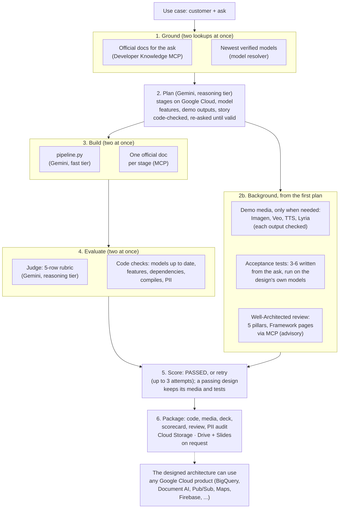
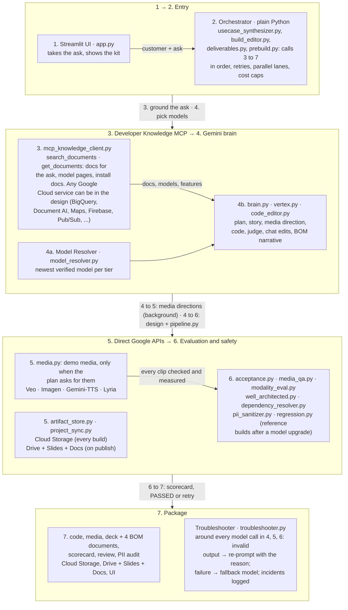

# Gemini + MCP Use-Case Studio

Turn a customer use case into a Google Cloud demo in 3 to 10 minutes (the built-in samples open instantly): a
grounded architecture, starter code, generated media, an editable deck and an eval scorecard.

Nothing ships unchecked: every build is judged on a rubric and acceptance-tested on its own models, every output
is reviewed and then measured with the market-standard metric of its modality (CLIP, VBench, EBU R128, WER,
Agent Platform evaluation service), and every model upgrade passes a golden set and a regression suite first
(all rules in [Evaluation](#4-evaluation-every-rule-rubric-and-threshold)).

**Author:** Layolin Jesudhass

## What you get

Type a use case, for example *"multilingual voice concierge for airline members"* or *"claims intake from
scanned forms"*. The studio returns:

- **Architecture**: each step mapped to a Google Cloud service and model, with the official doc behind every choice
- **Starter code**: a Python pipeline with its requirements and a README, packaged as a zip
- **Demo outputs**: videos, images, voice and music from Google's media models, or structured results, agent
  traces and chat demos (opened on a played, checked first reply, with charts) for non-media use cases; when the
  system reads documents or photos (claims intake, invoices, damage photos), a synthetic example of that input is
  shown before its extracted result, with the same names, numbers and dates. A video is as long as the ask says
  (4 to 32 seconds: a 16-second ad is two Veo shots, each continuing the last frame of the one before, joined into
  one file) and films what the brief names (the product in an ad, a presenter only when the ask wants one)
- **Story**: a hero, a challenge and a payoff, plus a presenter script
- **Bill of materials, complete for every custom demo**: a 4-slide deck on the Google Cloud reference
  architecture template, filled in place (the template's own typography, colours and cover art; the architecture
  in its icon language, one service card per stage with the product icon and the model it runs on) with the
  talk track in the speaker notes, plus the four Global Solutions documents: technical guidance, demo delivery
  guide, proof-of-concept runbook, and the AI agents and skills guide with a ready `SKILL.md`. PowerPoint and
  HTML locally; Google Slides and Docs when a Drive folder is set
- **Scorecard**: acceptance tests, judge scores, a privacy audit of the package, the reviewer's verdict on every
  output and the **measured, market-standard metrics per output modality** (CLIP-style alignment, VBench-style
  consistency, EBU R128 loudness, ASR word error rate, Agent Platform evaluation-service metrics)
- **Well-Architected review**: the design scored 1–5 on the five pillars of the Google Cloud Well-Architected
  Framework, with one finding and one recommendation per pillar, each citing the Framework page it comes from; the
  verdict is a design-review readiness gate ("Ready for design review" when every pillar scores 3 or more)
- **Chat**: ask questions or request changes ("add Korean", "shorten the video"), answered with doc citations

Example presets cover enterprise search with citations, document processing, an analytics agent, a voice
concierge and generative media. One sidebar picker, **Open a demo**, lists the samples and then your saved builds.
The samples are pre-built, so picking one opens a finished demo at once, and they are rebuilt in the background
whenever the studio moves to a newer model. Change the sample text in any way and the studio builds that new ask.

## How it works



Read it top to bottom: the numbered steps run in that order, boxes side by side run at the same time, and the background trio runs while steps 3 to 5 proceed. **MCP for knowledge, direct APIs for execution.** The MCP server supplies official docs (grounding, model discovery, citations); the orchestrator calls Google APIs itself; models come from the self-upgrading resolver. No agent framework runs the studio: the steps are fixed, so code decides, not the model. The models in the boxes are what the **studio** calls to make the kit; the **architecture it designs** can use any Google Cloud product.

- **No hard-coded models**: the studio finds the newest models in Google's docs, verifies them in your project,
  tests them on a golden set and rolls back automatically if quality drops.
- **Grounded**: every service, model and package comes with an official Google doc link.
- **Checked**: every build is scored, and failing steps are retried.

The full architecture (modules, workflows, every eval rule, deployment) is in the [Architecture](#architecture) section at the end of this page.

## Deploy in three steps

**1. Prerequisites**

- The [gcloud CLI](https://cloud.google.com/sdk/docs/install), signed in: `gcloud auth login`
- A Google Cloud project with billing, where you are an Owner
- Access to the models you want to show: preview models such as Veo appear only if your project can call them
- Python 3.10 or later, only for local runs

**2. Clone and deploy.** The project ID is the only value you have to give; everything else has a default.

```bash
git clone https://github.com/LUJ20/eliminating-custom-demo-toil-with-google-mcp.git
cd eliminating-custom-demo-toil-with-google-mcp
./deploy.sh --project YOUR_PROJECT_ID
```

The script enables the APIs, creates the bucket and a service account with only the roles the app needs, builds
the container, deploys it to Cloud Run behind Identity-Aware Proxy (IAP) and prints the URL. It takes about 5
minutes. The values it used are saved in `.env` (never committed), so the next `./deploy.sh` needs no flags;
re-run it any time to update the app.

**3. Open the URL and pick a sample.** Only you can open the app at first. To let others in:

```bash
./deploy.sh --project YOUR_PROJECT_ID --allow user:NAME@example.com,group:TEAM@example.com
```

Each new instance spends a few minutes picking the newest models; open the app sooner and the first page waits
for that, once.

**Run on your laptop instead:** `./deploy.sh --local --project YOUR_PROJECT_ID` opens http://localhost:8502. **Remove the app:** `gcloud run services delete gemini-mcp-studio --region us-central1`.

### Where to set what

| Setting | Easiest way | Also accepted |
| :--- | :--- | :--- |
| Google Cloud project | `--project YOUR_PROJECT_ID` | `GOOGLE_CLOUD_PROJECT` in `.env`, or your gcloud default project |
| Who can open the app | `--allow user:a@example.com,group:team@example.com` | `IAP_ALLOW` in `.env` |
| Bucket for packages and project backups | nothing: `YOUR_PROJECT_ID-gemini-mcp-studio` is created for you | `--bucket NAME` or `GCS_BUCKET` in `.env` |
| Google Drive folder (decks as Google Slides, scripts as Google Docs) | paste the folder link in the app's sidebar | `--drive-folder <folder link or ID>` or `DRIVE_FOLDER` in `.env`. On Cloud Run the folder must be in a **shared drive** with the service account `<service>@<project>.iam.gserviceaccount.com` added as Content manager (a service account has no My Drive storage); without it, decks are published to the bucket as `.pptx`. One-time setup, signed in as the account that uses the app: Drive → **Shared drives** → **New** (a shared drive, not a My Drive folder: its link ends in `/folders/0A…`, a My Drive folder's in `/folders/1…`) → **Manage members** → add the service account as **Content manager** → copy the link from the address bar |
| Cloud Run region, service name, instances kept warm | defaults `us-central1`, `gemini-mcp-studio`, `1` | `--region`, `--service`, `--min-instances`, or `CLOUD_RUN_REGION`, `CLOUD_RUN_SERVICE`, `CLOUD_RUN_MIN_INSTANCES` in `.env` |
| Agent Platform (model) location | default `global` | `--location` or `GOOGLE_CLOUD_LOCATION` in `.env` |
| Local port | default `8502` | `--port` |
| Eval thresholds, media limits, model policy | defaults | copy [.env.example](.env.example) to `.env` and edit; every knob is listed there with its default |

The sidebar also lets you switch the bucket, Drive folder and model mode for your own session without a
redeploy; the project is the one you deployed to.

## Well-Architected Framework

How the studio lines up with the [Google Cloud Well-Architected Framework](https://docs.cloud.google.com/architecture/framework) pillars, both as a service and in the designs it produces:

| Pillar | The studio itself | The designs it generates |
| :--- | :--- | :--- |
| [Operational excellence](https://docs.cloud.google.com/architecture/framework/operational-excellence) | One-command deploy, CI on every change, every model call logged with its reason and metrics, self-upgrading model resolver with daily drift check and a regression suite after each upgrade | Standard parameters (project placeholder, location, models map), a README and `--dry-run` entry point in every package, no model IDs in code |
| [Security, privacy, compliance](https://docs.cloud.google.com/architecture/framework/security) | IAP allow-list, least-privilege service account (three roles), secrets and personal data scrubbed before anything is published, model output treated as untrusted, generated code never executed | Google Cloud services only unless the ask names another vendor; the PII audit ships in the package |
| [Reliability](https://docs.cloud.google.com/architecture/framework/reliability) | Troubleshooter around every model call (re-prompt, fallback model), up to 3 build attempts, runtime watch with rollback and 24 h quarantine, environment errors never blamed on a model | Acceptance tests prove the use case works end to end on the chosen models; every stage cites an official doc |
| [Cost optimization](https://docs.cloud.google.com/architecture/framework/cost-optimization) | Media models called only when a deliverable needs them, per-build media cap, fast tier for code generation, a passing design keeps its media and tests across retries, pre-built samples shared by every visitor | The planner names a specific product per stage, so the deck shows what the customer would actually run and pay for |
| [Performance optimization](https://docs.cloud.google.com/architecture/framework/performance-optimization) | Parallel lanes (code, citations, media, tests), 6 acceptance tests and 4 sample builds at a time, saved decks redrawn without a rebuild | Newest verified model per tier, with the documented features of that model configured in code |

Every build also gets a **Well-Architected review of the design it produced** (`engine/well_architected.py`): the Framework's pillar pages are retrieved through the Developer Knowledge MCP server, and a reasoning-tier Gemini model scores the design 1–5 per pillar with one finding and one recommendation each, citing the page it comes from. **Ready for design review** when every pillar scores 3 or more, otherwise **Needs work before design review**. It is advisory (it never changes the build score) and ships as a section of the result page, a slide in the deck and `WELL_ARCHITECTED_REVIEW.md` in the package. Switch: `WELL_ARCHITECTED_REVIEW=false`.

Not a substitute for an architecture review: the studio grounds and checks a demo design, it does not certify a production workload.

## Architecture

### 1. Core Architectural Pattern

The codebase uses a **deterministic Python orchestrator** pattern (`Orchestrator → Gemini Brain + MCP Knowledge + Direct Google API Tools`) rather than an open-ended autonomous tool-calling loop. The boxes are numbered in the order one build uses them; each arrow is what a step hands to the next:



#### Design Responsibilities
| Layer | Implementation | Responsibility |
| :--- | :--- | :--- |
| **Orchestrator** | `engine/usecase_synthesizer.py`, `engine/build_editor.py`, `engine/deliverables.py` | Controls step ordering, retry loops, concurrency limits, cost caps, and fallbacks. |
| **Knowledge (MCP)** | `engine/mcp_knowledge_client.py` | Queries Google Developer Knowledge MCP (`search_documents`, `get_documents`) so every service, model ID, feature, package, and citation is grounded in official docs. |
| **Brain (Gemini)** | `engine/brain.py`, `engine/vertex.py` | Generates architecture plans, starter code, judge scores, QA verdicts, acceptance tests, and chat edit plans as validated JSON. |
| **Model Resolver** | `engine/model_resolver.py` | Dynamically discovers, verifies, canary-tests, monitors, and rolls back models across 11 capability tiers (zero hardcoded model IDs). |
| **Direct Tools** | `engine/media.py`, `engine/artifact_store.py`, `engine/project_sync.py` | Invokes Agent Platform media APIs, Cloud Storage, and Google Drive/Slides/Docs directly from Python. |


### 2. Directory & Module Layout

```text
Gemini+MCP/
├── app.py                          # Streamlit web UI (use-case input, one Open-a-demo picker: pre-built samples + saved builds, 6 result sections, build chat)
├── deploy.sh                       # One-command Cloud Run + IAP deployment or local launch (--local)
├── Dockerfile                      # Container build definition (runs python -m engine.serve)
├── requirements.txt                # Runtime Python dependencies
├── engine/                         # Core application backend
│   ├── serve.py                    # Cloud Run entrypoint: model warm-up + project sync + sample pre-build + Streamlit
│   ├── config.py                   # Settings, policy thresholds, and credential resolution (.env / gcloud / ADC)
│   ├── common.py                   # Shared utilities: atomic locked JSON/JSONL I/O, retries, text helpers
│   ├── mcp_knowledge_client.py     # HTTP/JSON-RPC client for Google Developer Knowledge MCP server
│   ├── vertex.py                   # Agent Platform REST calls (generateContent, predict, embeddings, model probes)
│   ├── model_resolver.py           # Self-upgrading model discovery, verification, golden set, canary & rollback
│   ├── troubleshooter.py           # Error classification, safe auto-remediation, model fallback, incident logs
│   ├── brain.py                    # System prompts and JSON schema validators for planner, codegen, judge, director
│   ├── usecase_synthesizer.py      # End-to-end build pipeline orchestrator (plan → code → judge, checks overlapped)
│   ├── samples.py                  # The 8 sample use cases shown in the sidebar (one source for UI and pre-builder)
│   ├── prebuild.py                 # Pre-builds the samples; rebuilds them when a newer model is in use
│   ├── manifest.py                 # Deliverables manifest schema, output kinds, tiers, and contracts
│   ├── deliverables.py             # Background parallel deliverable generation and retry loop (chats: direct → play → check → replay)
│   ├── media.py                    # Agent Platform media generators (Veo video, Imagen/Gemini image, TTS, Lyria music) and chat turns
│   ├── media_qa.py                 # Per-deliverable quality checker, critic feedback, and best-attempt selector
│   ├── charts.py                   # Splits a chat reply into markdown, code and ```chart CSV blocks the UI draws as line charts
│   ├── acceptance.py               # End-to-end use-case acceptance test planner, runner, and evaluator
│   ├── well_architected.py         # Well-Architected review: 5 pillars scored from Framework pages retrieved via MCP (advisory)
│   ├── regression.py               # Post-upgrade regression runner against reference use cases
│   ├── dependency_resolver.py      # PyPI/MCP-grounded package name & version verifier for requirements.txt
│   ├── pii_sanitizer.py            # Secret and PII scanner/redactor for generated code and packages
│   ├── deck_generator.py           # 4-slide reference-architecture deck: the template filled in place, icon diagram
│   ├── bom_template.py             # Where the template .pptx lives (templates/, bucket _templates/) and how to fetch it
│   ├── deck_icons.py               # Product icons for the diagram: folder discovery, bucket zip, service-name lookup
│   ├── slide_viewer.py             # HTML/SVG slide player for the Streamlit UI (shapes, pictures, connectors, tables)
│   ├── story_doc.py                # Narrative arc and presenter talk-track generator (.html / Google Doc)
│   ├── artifact_store.py           # Publisher for Google Drive folders and Cloud Storage buckets
│   ├── project_sync.py             # Bidirectional background sync between generated_projects/ and GCS (_projects/)
│   ├── build_editor.py             # Interactive post-build chat assistant (grounded Q&A + build mutations)
│   ├── code_editor.py              # Chat-driven code modifier with re-validation, re-judging, and diffing
│   ├── versions.py                 # Snapshot manager for Undo, Save, and Discard across chat edits
│   └── bom.py                      # Bill of materials: the four Global Solutions documents and the SKILL.md
├── evals/
│   ├── reference_cases.json        # 4 canonical use cases for model upgrade regression testing
│   └── chat_intents.json           # 36 benchmark prompts for testing chat intent classification
├── scripts/
│   ├── eval_chat_intents.py        # CLI runner for the chat intent evaluation benchmark
│   └── make_studio_assets.py       # Generator for architecture diagrams and overview slide deck
└── tests/                          # Offline unit test suite (fakes-driven, no live cloud calls required)
```


### 3. End-to-End Workflows

#### 3.1 Build Pipeline (`engine/usecase_synthesizer.py`)
1. **Grounding**: Queries `McpKnowledgeClient` (`search_documents` and `get_documents`) for official Google Cloud docs matching the customer use case (in parallel with the model catalog read).
2. **Model Catalog**: Fetches the active verified model per capability tier from `ModelResolver`.
3. **Architecture & Story Planning**: Uses the `reasoning` tier (`brain.py`) to design pipeline stages, story scenes (hero, challenge, payoff), and a deliverables manifest (`manifest.py`).
4. **Parallel Deliverable Generation**: As soon as the first valid plan is produced, `deliverables.py` generates up to 6 outputs in parallel (video, image, speech, music, structured JSON/tables, agent traces, text, chat demos); every output is checked and regenerated with the findings when it fails. A chat demo is directed, played once against the real model and opened on that checked first reply. A video is as long as the ask says (4 to 32 seconds): Veo films shots of up to 8 seconds, each continuing the last frame of the one before, joined with ffmpeg into one file. When the system reads documents or photos, a synthetic example of that input is generated before its extracted result.
5. **Acceptance Tests Start Early**: At that same first plan, `acceptance.py` plans 3–6 use-case-specific tests and runs them (6 in parallel) in the background against the design's models, overlapping code generation and judging instead of running after them. A test run is keyed by the design (stages, services, features, story), so a retry that keeps the design reuses it.
6. **Well-Architected Review Starts Early**: Also at that first plan, `well_architected.py` retrieves the Framework's five pillar pages (and the AI/ML perspective) through MCP, cached per process for a day, and asks the `reasoning` tier to score the design 1–5 per pillar with a finding, a recommendation and the source page for each; the answer is validated by code (every pillar, scores in range, sources that exist) and re-asked on failure. Keyed by the design like the acceptance tests, advisory, and shown as "Not reviewed" when MCP or the model is unavailable.
7. **Code Generation & Packaging**: Uses the `fast` tier to generate `pipeline.py` (with `--dry-run` support) while citations are attached in parallel, resolves dependencies via `DependencyResolver` (in parallel with the judge), and scans all files for secrets/PII with `PIISanitizer`.
8. **Scorecard & Retry Loop**: Evaluates the build using 5 LLM judge rubric rows and 6–7 programmatic checks, retrying up to 3 attempts with critic feedback. A retry whose design passed every check keeps the whole blueprint and rewrites only the code, so generated media and running acceptance tests carry over; only a design-level failure re-plans.
9. **Deck, Story & Publishing**: Generates the deck (`deck_generator.py`, stamped with `DECK_VERSION`) and the `.zip` package in parallel, the presenter script (`story_doc.py`) and the bill-of-materials documents (`bom.py`), then publishes them via `ArtifactStore` to Google Drive (Slides and Docs) or Cloud Storage.

Typical wall time: about 3 minutes for a data/agent use case, 8–10 minutes when the demo includes several video clips.

#### 3.2 Self-Upgrading Model Resolver (`engine/model_resolver.py`)
1. **Discover**: Scans Google Developer Knowledge MCP documentation for candidate model IDs across 11 tiers (`reasoning`, `fast`, `lite`, `live`, `image`, `image_fast`, `video`, `video_fast`, `music`, `speech`, `embedding`).
2. **Lifecycle**: Reads Google's model lifecycle pages through the same MCP server (the Agent Platform *model versions and lifecycle* page first, then the Gemini API *deprecations* page, then release notes; the first page that names a model wins) for each model's retirement date, a "or later" floor, a "no date announced" note and its listed replacement. A model whose firm retirement date is within 180 days [`RETIRE_WITHIN_DAYS`] is not used while its tier has another verified model (a tier is never emptied by this rule); floors and undated models are shown, not excluded. A listed replacement that no tier pattern matches (a new model family, for example a `gemini-omni` successor of a Veo preview) joins the retiring model's tier as a candidate and goes through the same verification and gate, so a rename never strands a tier. Retirement dates appear in the models-in-use caption.
3. **Verify**: Checks availability in Model Garden and runs a live probe call.
4. **Gate (Golden Set & Canaries)**:
   - Text tiers run a 9-task role-based golden benchmark (must score $\ge 7/9$, match or beat current champion, and stay within $2\times$ latency).
   - Media and embedding tiers run modality-specific quality canaries.
5. **Promote, Regression Check & Sample Refresh**: On promotion, triggers `regression.py` across the 4 reference use cases in `evals/reference_cases.json`, then `prebuild.py` rebuilds the sample demos that used the replaced model (hooks run in order, so a rollback happens before any sample is rebuilt). A champion set aside by the lifecycle rule is replaced the same way (the promotion hooks fire with the reason).
6. **Runtime Watch & Rollback**: Tracks a sliding window of the last 8 calls per model (ignoring environment/credential/HTTP 429 errors via `Troubleshooter`). If model quality or reliability degrades, automatically rolls back to the previous champion and quarantines the failing model for 24 hours.

#### 3.3 Post-Build Chat & Versioning (`engine/build_editor.py`)
1. **Context Assembly**: Combines up to 8 MCP documentation pages with full build facts (scores, rubric reasons, chosen models, story scenes, deliverables, and QA checks).
2. **Intent Classification**: Routes user input into one of three paths:
   - **Question**: Generates a grounded answer and runs a citation verification check (retrying once if a claim is unsupported by the cited doc).
   - **Build Change** (outputs, docs, or code): Takes a snapshot via `versions.py`, applies the requested edits (regenerating only modified deliverables or running `code_editor.py` with full re-judging and diff generation), and runs a change-completion check (`done` / `partly` / `not done`).
   - **Refusal**: Blocks out-of-policy requests (e.g., using unverified models, disabling security checks, exceeding cost caps) with a clear explanation.

#### 3.4 Keeping up with Google: model retirements and product renames

Two things change under a demo studio without anyone touching it: models retire, and products get new names. Both are handled by code, from the official docs, and both are checked on every model refresh (at start and daily) and on every build.

**Model retirement check** (`engine/model_resolver.py`, `engine/config.py`, `app.py`)

| Step | How |
| :--- | :--- |
| Source | On every refresh, `discover()` asks the Developer Knowledge MCP server for Google's lifecycle pages and reads them with `get_documents`: the Agent Platform **model versions and lifecycle** page first, then the Gemini API **deprecations** page, then the release notes (`LIFECYCLE_PRIORITY`). `parse_retirements` reads the tables (model, retirement date, replacement) and the prose (one model per sentence, the first date after "retire / shut down / deprecated"); `merge_lifecycle` keeps the first page that names a model, so the Agent Platform page wins when the two pages disagree, and records which page it came from (`retire_source`) |
| What is recorded | Per model: `retires_on` (a firm date), `retire_floor` ("November 17, 2026 **or later**": a floor, not a date), "no retirement date announced" (known, undated) and the replacement Google lists. Stored in the registry under `lifecycle` and copied onto every tier entry (`ENTRY_KEYS`) |
| The rule | In `_verify`, a candidate whose **firm** retirement date is within **180 days** [`RETIRE_WITHIN_DAYS`] gets status `retiring` and is treated like a model that is gone (`GONE`), **only while the tier has another verified model**: a tier is never emptied by this rule, so a floor, an undated model, or the last model standing stays in use. `_gate` and `_promote_newest` then replace a retiring champion through the normal gate (golden set or media canary) and fire the promotion hooks with the reason "replaces the champion set aside this refresh", so the regression suite runs and the samples that used the old model are rebuilt |
| Renamed model families | A listed replacement that no tier's naming pattern matches (for example `gemini-omni-1.1-flash` as the successor of a Veo preview) is added to the retiring model's tier by `_follow_replacements` with `followed=<old model>`, verified and gated like any candidate (`_still_valid` accepts followed entries), so a rename never strands a tier and no pattern has to be edited first |
| Where it shows | The models-in-use caption under a build reads "(retires 2026-10-20)" or "(retires 2026-11-17 or later)" (`ModelResolver.retirement`); the registry's `rows()` carry a "Retires" column for the CLI; `_lifecycle_notes` logs every model in use with a date. Production mode: a GA champion that is retiring is set aside the same way, so a build moves to Google's listed replacement |

**Product rename check** (`engine/common.py`, `engine/brain.py`, `engine/build_editor.py`, `engine/deck_generator.py`)

| Step | How |
| :--- | :--- |
| Source | The planner is grounded in the current official docs through MCP on every build, so new names arrive with the docs. The rename table `CURRENT_NAMES` in `engine/common.py` is kept from the Agent Platform release notes (mid-2026: Vertex AI → Gemini Enterprise Agent Platform, "Agent Platform" for short; Vertex AI Search → Agent Search; Agent Engine → Agent Runtime; Vertex AI Studio → Agent Studio; Agent Builder; Model Garden unchanged), longest names first so "Vertex AI Search" is never cut to "Agent Platform Search" |
| At plan time | The planner prompt says to use the names the docs use today; `brain.validate_plan` then runs `current_names()` over the summary and every stage field (stage, service, API, description), so a model that still writes the old name cannot put it into a plan. The code-generation prompt names Agent Platform (formerly Vertex AI) with the `google-genai` SDK |
| Saved builds | `build_editor.load_result` applies `current_names()` to the summary, the stage fields and the doc titles of every build when it is opened, so demos built before a rename show the current names without a rebuild; bumping `DECK_VERSION` (6 did this) redraws saved decks from the stored result in seconds |
| What is never touched | Technical identifiers: `aiplatform.googleapis.com`, `roles/aiplatform.*`, the SDK's `vertexai=True`, doc URLs under `/vertex-ai/`. The patterns need the space-separated product name, so code and endpoints keep working |

Limits: the rename table is maintained by hand from the release notes (renames are rare and prose-only; parsing them automatically would be guesswork), while retirement dates are read from the docs on every refresh. Neither check needs a redeploy: the lifecycle pages are re-read daily, and a rename edit is one line in `CURRENT_NAMES`.


### 4. Evaluation: every rule, rubric and threshold

Every build, demo output, chat change and model upgrade is evaluated. Thresholds are environment variables (names in brackets); judges are Gemini models from the `reasoning` tier, and every rule with a programmatic check is enforced by code, not by a judge.

#### 4.1 When evals run

| Event | Evals |
| :--- | :--- |
| A build | Build scorecard (up to 3 attempts; a code-only retry keeps a passing design) · acceptance tests, started with the first valid plan and run alongside code generation and judging (6 at a time) · Well-Architected review of the chosen design (advisory) · output checks on every demo output |
| A sample pre-build (app start, model promotion) | The same evals as a build: the saved samples are real builds |
| A chat message | Question: citation check. Change: validation → change check (code changes are also re-judged) |
| Daily model refresh | Promotion canary for new models · drift check on current models · retirement check against Google's lifecycle pages (M7) |
| Every model call | Runtime watch (errors, invalid outputs, failed output checks) |
| After a model upgrade | Regression suite on the reference use cases, then the sample demos are rebuilt on the new models |
| Before a release | Chat intent set (`scripts/eval_chat_intents.py`) · offline unit tests (`python -m unittest discover -s tests`) |

#### 4.2 Build scorecard — is the design and code right? (`engine/brain.py`, `engine/usecase_synthesizer.py`)

| Rule | Pass |
| :--- | :--- |
| R1 Judge rubric: requirement coverage · grounded in official docs · code implements the design · demo shows what was asked · demo tells a story | Judge score **4/5 or better** on each row [`EVAL_MIN_JUDGE_SCORE`] |
| R2 Models up to date | Every AI stage uses the newest verified model of its tier |
| R3 Feature showcase (AI stages only) | The showcased model features are configured in the code |
| R4 Doc citations | Every stage cites an official Google doc |
| R5 Code validity | `pipeline.py` compiles and has a `--dry-run` entry point |
| R6 Dependencies | Every import is documented in an official Google doc |
| R7 Security / PII | 0 findings after redaction |
| R8 Standard parameters | Project placeholder, location, models map; no model IDs in code |
| R9 Use case works end to end | **80 % or more** of the acceptance tests pass and no safety failure [`ACCEPTANCE_MIN_PASS`] |
| R10 Google Cloud only (plan time) | Every stage runs on a specific Google Cloud product (never just "Google Cloud"). Another vendor's service, a bare protocol or a client platform (AWS, Twilio, WebRTC, Android…) is accepted only when the ask or the customer names it; the stage card then says so. A plan that breaks this is sent back to the planner with the reason |
| R11 Short stage cards (plan time) | Stage name 2–3 words, API 2–5 words, description one plain 8–14 word sentence; a plan over the caps (4 words / 32 characters, 8 words, 20 words) is sent back |

**Score** = mean of the rows (judge rows as score/5, checks as 1 or 0). **PASSED** = every row passes. Otherwise up to 3 attempts [`EVAL_MAX_ATTEMPTS`] with the failed rows fed back as fixes; the best attempt is kept as **BEST EFFORT**. R10 and R11 are checked when the plan is parsed, so they never reach the scorecard: the planner re-answers until they hold.

#### 4.3 Acceptance tests — does the use case actually work? (`engine/acceptance.py`)

| Rule | Pass |
| :--- | :--- |
| A1 3–6 tests written from the ask, every requirement covered [`ACCEPTANCE_MAX_TESTS`] | Valid tests, each tied to a requirement and a stage |
| A2 Each test runs on the build's own stage model | A valid output in the contract for its type |
| A3 Checks by type: answer (facts, citations support the claims) · structured (schema) · agent (right tools, right order, nothing forbidden) · retrieval (expected source in the top 3) · classification (right label) · translation (language) · conversation and generation (facts) · all (safe, on task) | All critical checks pass |

Acceptance tests run the **design** (stages + chosen models), not the generated code.

#### 4.4 Well-Architected review — is the design well built? (`engine/well_architected.py`)

| Rule | Pass |
| :--- | :--- |
| W1 Grounded in the Framework | The pillar pages come from the Developer Knowledge MCP server (Framework pages first, at most 8); no pages, no review ("Not reviewed", never a failed build) |
| W2 Five pillars, scored 1–5 | Operational excellence · security, privacy and compliance · reliability · cost optimization · performance optimization; each with a finding about this design and a recommendation naming a Google Cloud service or setting, each citing one retrieved page (checked by code; a bad answer is re-asked with the reason) |
| W3 Readiness gate | **Ready for design review** = every pillar **3 or more**; otherwise **Needs work before design review** |

The review is advisory: it never changes the build score or triggers a retry. Judged by the `reasoning` tier; the same model and location policy as the other judges. Switch: [`WELL_ARCHITECTED_REVIEW`].

#### 4.5 Demo outputs — is each output right? (`engine/media_qa.py`)

| Output | Critical checks | Soft checks |
| :--- | :--- | :--- |
| Video | language, script, lip-sync, same person, brand safe, matches the prompt and brief (the subject the brief names: the product in an ad, not a person talking about it unless asked) | on-screen text legible, plays the scene, length (the clip runs the planned length ± 1.5 s, read from the file by code) |
| Image | brand safe, on-screen text legible (a form or chart with garbled text is regenerated), matches the prompt and brief | plays the scene |
| Speech | language, script, brand safe | plays the scene |
| Music | brand safe | mood, plays the scene |
| Text | written language, matches the brief, brand safe | plays the scene |
| Chat (opener + played first reply) | written language, matches the brief (answers from its Context, never asks for data, charts a trend), brand safe | plays the scene |
| Table / JSON result | schema valid, matches the brief, written language, brand safe | plays the scene |
| Agent trace | schema valid, matches the brief, plausible steps, safe actions, brand safe | plays the scene |

A critical failure regenerates the output with the findings, up to 2 more rounds [`MEDIA_RETRIES`], best kept (a chat is played again with the findings appended to its system instruction). A clip or image that fails **matches the prompt and brief** is not refilmed from the same prompt: the media director writes the prompt (and each shot's script) again with the previous prompt and the reviewer's finding, then it is made and checked again. The soft **length** check and **plays the scene** never fail an output; they lower its score and are listed in the scorecard notes ("not the planned length", "off-scene"). At plan time, `manifest.py` also checks that every declared visual input has its example image listed before the deliverable that reads it (a plan that breaks this is sent back to the planner). The live **Demo output quality** row = all outputs pass their critical checks; with the sidebar switch **Show output checks** on, each output also shows one collapsed "Checks: n/m passed" line with the reviewer's summary (off by default; a failed check still highlights that output's Regenerate button).

#### 4.5a Measured output metrics — market-standard metrics per modality (`engine/modality_eval.py`)

Next to the reviewer's checks (the LLM-as-a-judge layer above), every ready output is **measured** with the metric the industry uses for its modality. Nothing is simulated: a value is read from the file, computed from embeddings, or returned by the Agent Platform evaluation service; what this server cannot measure is listed as "not measured" with the reason.

| Modality | Metric (standard) | Target |
| :--- | :--- | :--- |
| Image | Text–image alignment, CLIP-score protocol: cosine of the prompt and the image in the multimodal embedding space (`multimodalembedding@001`), judged as zero-shot retrieval — the image ranks its own prompt first among six unrelated captions (R@1) · resolution and aspect | R@1 · long side ≥ 1024 px, 16:9 |
| Video | The same alignment on 8 evenly sampled frames · temporal consistency (VBench subject/background protocol: mean cosine of consecutive frame embeddings; one scene change allowed per joined shot) · temporal flicker (ffmpeg `signalstats` YDIF, report only) · black frames (`blackdetect`) · frozen frames (`freezedetect`) · duration against the plan, frame rate, resolution (ffprobe) | R@1 · ≥ 0.80 · report · 0 s · 0 s · plan ± 1.5 s, ≥ 23.9 fps, ≥ 720p |
| Speech | EBU R128 / ITU-R BS.1770 integrated loudness, loudness range (report), true peak (ffmpeg `ebur128`) · silence lead / tail / longest gap (`silencedetect`) · intelligibility as ASR word error rate: a `fast`-tier model transcribes the clip and the transcript is aligned with the script (Levenshtein over words) | −24 to −14 LUFS · ≤ −1 dBTP · ≤ 1 s / ≤ 1.5 s / ≤ 2 s · WER ≤ 10 % |
| Music | EBU R128 integrated loudness, true peak · dropouts (internal silence) · duration (report) | −24 to −12 LUFS · ≤ −1 dBTP · no gap > 2 s |
| Text | Agent Platform evaluation service (`evaluateInstances`) pointwise metrics: fluency, coherence (1–5), safety (0/1), fulfillment against the generation prompt (1–5) | ≥ 4 · ≥ 4 · 1 · ≥ 4 |
| Chat (first reply) | fluency, coherence, safety, fulfillment against the system instruction + opener, groundedness against the system context (0/1) | ≥ 4 · ≥ 4 · 1 · ≥ 4 · 1 |
| Table / JSON result | JSON contract (code) · fluency · safety · fulfillment | valid · ≥ 4 · 1 · ≥ 4 |
| Agent trace | JSON contract (code) · tool-call validity (`tool_call_valid`) · safety · fulfillment | valid · 1 · 1 · ≥ 4 |

| Rule | Pass |
| :--- | :--- |
| O1 Measured, never simulated | Every value comes from the file (ffprobe / ffmpeg), the multimodal embedding model, a transcription, or the evaluation service; a failed measurement reads "not measured: reason", never a number |
| O2 Standard protocols | CLIP retrieval R@1 against unrelated captions (not the demo's sibling briefs, which share the subject); VBench consistency on consecutive frames; EBU R128 loudness and true peak; WER on normalised words; evaluation-service metrics on their published scales |
| O3 Advisory | Measured after the reviewer's verdict: never delays a usable output, never regenerates it, never changes the build score. Shown as the live scorecard row **Output metrics (market standard)** and as a "Metrics: n/m within target" line with the metric table under each output |
| O4 Honest gaps | Aesthetic predictors (NIMA, LAION), non-intrusive speech MOS (UTMOS, NISQA, DNSMOS), CLAP text–music alignment and VBench motion smoothness need model weights the Cloud Run image does not ship: listed as not measured, per modality |

Saved demos built before this layer existed are measured in the background on the first page load (`engine/prebuild.py`, with the review and BOM sweep). Switches: [`OUTPUT_METRICS`] (default on), [`MULTIMODAL_EMBEDDING_MODEL`] (default `multimodalembedding@001`, a regional Agent Platform model, not a resolver tier). Cost per output: image 2 embedding calls (+6 cached distractor captions, once per process); video 9 (+6 once); speech one `fast`-tier transcription; text / chat / data 3–5 evaluation-service calls, run in parallel. Tests: `tests/test_modality_eval.py`.

#### 4.6 Chat — is the answer or change right? (`engine/build_editor.py`)

| Rule | Pass |
| :--- | :--- |
| C1 Questions are answered from build facts + official docs, with citations | Every citation number exists |
| C2 Citation support | Each cited doc supports its sentence; otherwise one retry, then marked unverified |
| C3 Changes are validated like a build | Valid manifest, no unverified models, under the media cap |
| C4 Change check | "done / partly / not done" compared with the request, shown in the reply |
| C5 Code changes | Re-validated, PII + dependencies re-scanned, re-judged, re-scored; diff shown |
| C6 Refusals | Studio changes, unverified models, disabling security, over the cost cap |
| C7 Intent test set (36 requests across all use-case types) | 90 % or more routed correctly as question / change / refusal |

#### 4.7 Model upgrades — is a new model at least as good, and does it stay good? (`engine/model_resolver.py`, `engine/regression.py`)

| Rule | Pass |
| :--- | :--- |
| M1 Found in official docs and callable in your project | Listed in Model Garden and a probe call answers |
| M2 Text models: 9-task golden set by role (plan JSON, code, grounded answer, judge flags a defect, judge accepts good code, checker catches the wrong language, tool use, citation faithfulness, story plan); scored by code | **7 of 9 or better** and at least the current model's score; p50 latency at most 2× [`PROMOTE_MIN_SCORE`, `PROMOTE_MAX_LATENCY_RATIO`] |
| M3 Embedding, image, video, speech, music models: quality canary, run only when a new model would replace the current one | Embedding: paraphrases closer than unrelated text (+0.05). Image / speech / music / video: a real sample of the right type and size; a bad sample is not retried for 72 h [`MEDIA_CANARY`, `MEDIA_CANARY_VIDEO`] |
| M4 Daily drift check (text models) | At most 1 golden task lower than at promotion [`DRIFT_TOLERANCE`] |
| M5 Runtime watch (all models) | Over the last 8 calls: error rate below 50 % and quality 0.6 or better, where failed output checks count as bad quality; credential, network, project-setup and rate-limit (429) errors are ignored [`ROLLBACK_*`] |
| M6 Regression suite after an upgrade (4 reference use cases: voice/avatar, RAG search, agent + data, document extraction) | No case drops more than 10 points and no row that passed now fails [`REGRESSION_MAX_DROP`] |
| M7 Retirement (all models), from Google's lifecycle pages via MCP | A model with a firm retirement date within 180 days is not used while its tier has another verified model; a "or later" floor or "no date announced" is shown, not excluded; Google's listed replacement joins the tier even under a new name [`RETIRE_WITHIN_DAYS`] |

On failure the model is **held** (not promoted) or **rolled back** to the last known good one and **quarantined for 24 h** [`QUARANTINE_HOURS`]. If the older model fails the same task the same way, the newer one is restored (the task is at fault, not the model). If every regression build errors, the result is inconclusive and nothing is rolled back.

#### 4.8 Rules that always apply, and known limits

1. No hard-coded model IDs anywhere; models come from the resolver and generated code reads them from config.
2. Environment failures (expired credentials, network, disabled API, permissions, rate limits) never count against a model.
3. Every model change is logged with its reason and metrics.
4. Model output is treated as untrusted: escaped in the UI, validated before use; generated code is checked, never executed (running it in an isolated Cloud Run job is the next step).
5. Judges and checkers are AI models and can be wrong; the rules with a programmatic check are the most reliable. The Live API model is availability-checked and its latency recorded; there is no conversation canary yet.

### 5. Deployment & Persistence Architecture

* **Local Mode** (`./deploy.sh --local`): Runs Streamlit on `localhost:8502` using local `gcloud` user credentials and optional Google Drive publishing (`--drive-folder`). The app pre-builds the missing or stale samples in the background on its first page load.
* **Cloud Run Mode** (`./deploy.sh --project <ID>`):
  - Provisions required GCP APIs, a dedicated least-privilege service account (`gemini-mcp-studio`), and a Cloud Storage bucket (`<project>-gemini-mcp-studio`).
  - Deploys the container to Cloud Run behind **Identity-Aware Proxy (IAP)** so only authorized users/groups can access the studio.
  - `engine/serve.py` warms up the model registry in `.cache/` on startup, runs `engine/project_sync.py` in a background daemon thread to restore and back up `generated_projects/` to `gs://<bucket>/_projects/` every 60 seconds, and then starts `engine/prebuild.py` (after the restore and once models are resolved) so a fresh instance fills in whatever samples the bucket did not have, without waiting for a visitor; the same thread then redraws old decks, adds the Well-Architected review to saved demos that predate it, and plays the first reply of any chat demo that has none.
* **Knobs**: `PREBUILD_SAMPLES` (default `true`) turns the pre-build off; `PREBUILD_PARALLEL` (default 4) is how many samples build at once; `python -m engine.prebuild --status` reports which samples are current, `--force` rebuilds all, `--push` uploads them to the bucket, `--decks` only redraws the decks of saved projects for a new slide layout, `--chats` only re-directs and plays the chat demos that have no first reply yet, `--reviews` only adds the Well-Architected review to saved projects that have none.

Offline unit tests: `python -m unittest discover -s tests` (509 tests, about 7 seconds, no cloud calls). CI (`.github/workflows/ci.yml`) runs the same suite plus a `bash -n deploy.sh` syntax check on every push and pull request, with the actions pinned to commit hashes and a read-only token.
